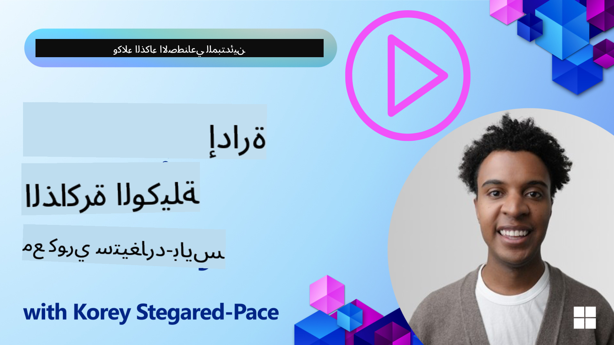

<!--
CO_OP_TRANSLATOR_METADATA:
{
  "original_hash": "c27e2a2e9055910545560e8472b341d8",
  "translation_date": "2025-10-02T10:57:16+00:00",
  "source_file": "13-agent-memory/README.md",
  "language_code": "ar"
}
-->
# الذاكرة لوكلاء الذكاء الاصطناعي

عند الحديث عن الفوائد الفريدة لإنشاء وكلاء الذكاء الاصطناعي، يتم التركيز عادةً على أمرين رئيسيين: القدرة على استدعاء الأدوات لإتمام المهام والقدرة على التحسن بمرور الوقت. الذاكرة هي الأساس لإنشاء وكيل ذاتي التحسين يمكنه تقديم تجارب أفضل لمستخدمينا.

في هذه الدرس، سنستعرض مفهوم الذاكرة لوكلاء الذكاء الاصطناعي وكيفية إدارتها واستخدامها لصالح تطبيقاتنا.

## المقدمة

ستتناول هذه الدرس:

• **فهم ذاكرة وكلاء الذكاء الاصطناعي**: ما هي الذاكرة ولماذا هي ضرورية للوكلاء.

• **تنفيذ وتخزين الذاكرة**: طرق عملية لإضافة قدرات الذاكرة لوكلاء الذكاء الاصطناعي، مع التركيز على الذاكرة قصيرة وطويلة المدى.

• **جعل وكلاء الذكاء الاصطناعي ذاتية التحسين**: كيف تمكّن الذاكرة الوكلاء من التعلم من التفاعلات السابقة والتحسن بمرور الوقت.

## أهداف التعلم

بعد إكمال هذه الدرس، ستتمكن من:

• **التمييز بين أنواع مختلفة من ذاكرة وكلاء الذكاء الاصطناعي**، بما في ذلك الذاكرة العاملة، قصيرة المدى، طويلة المدى، وأشكال متخصصة مثل ذاكرة الشخصية والذاكرة الحلقية.

• **تنفيذ وإدارة الذاكرة قصيرة وطويلة المدى لوكلاء الذكاء الاصطناعي** باستخدام إطار عمل Semantic Kernel، والاستفادة من أدوات مثل Mem0 وذاكرة Whiteboard، والتكامل مع Azure AI Search.

• **فهم المبادئ وراء وكلاء الذكاء الاصطناعي ذاتية التحسين** وكيف تساهم أنظمة إدارة الذاكرة القوية في التعلم المستمر والتكيف.

## فهم ذاكرة وكلاء الذكاء الاصطناعي

في جوهرها، **تشير ذاكرة وكلاء الذكاء الاصطناعي إلى الآليات التي تمكنهم من الاحتفاظ بالمعلومات واسترجاعها**. يمكن أن تكون هذه المعلومات تفاصيل محددة عن محادثة، تفضيلات المستخدم، إجراءات سابقة، أو حتى أنماط مكتسبة.

بدون ذاكرة، تكون تطبيقات الذكاء الاصطناعي غالبًا عديمة الحالة، مما يعني أن كل تفاعل يبدأ من الصفر. يؤدي ذلك إلى تجربة مستخدم متكررة ومحبطة حيث "ينسى" الوكيل السياق أو التفضيلات السابقة.

### لماذا تعتبر الذاكرة مهمة؟

ترتبط ذكاء الوكيل بقدرته على استدعاء واستخدام المعلومات السابقة. تتيح الذاكرة للوكلاء أن يكونوا:

• **انعكاسيين**: التعلم من الإجراءات والنتائج السابقة.

• **تفاعليين**: الحفاظ على السياق خلال محادثة مستمرة.

• **استباقيين وتفاعليين**: توقع الاحتياجات أو الاستجابة بشكل مناسب بناءً على البيانات التاريخية.

• **مستقلين**: العمل بشكل أكثر استقلالية من خلال الاستفادة من المعرفة المخزنة.

الهدف من تنفيذ الذاكرة هو جعل الوكلاء أكثر **موثوقية وقدرة**.

### أنواع الذاكرة

#### الذاكرة العاملة

فكر في هذه الذاكرة كقطعة من الورق يستخدمها الوكيل أثناء مهمة واحدة أو عملية تفكير مستمرة. تحتفظ بالمعلومات الفورية اللازمة لحساب الخطوة التالية.

بالنسبة لوكلاء الذكاء الاصطناعي، تلتقط الذاكرة العاملة المعلومات الأكثر صلة من المحادثة، حتى لو كان سجل الدردشة طويلًا أو مقطوعًا. تركز على استخراج العناصر الرئيسية مثل المتطلبات، المقترحات، القرارات، والإجراءات.

**مثال على الذاكرة العاملة**

في وكيل حجز السفر، قد تلتقط الذاكرة العاملة طلب المستخدم الحالي، مثل "أريد حجز رحلة إلى باريس". يتم الاحتفاظ بهذا الطلب المحدد في سياق الوكيل الفوري لتوجيه التفاعل الحالي.

#### الذاكرة قصيرة المدى

تحتفظ هذه الذاكرة بالمعلومات طوال مدة محادثة واحدة أو جلسة واحدة. إنها سياق الدردشة الحالية، مما يسمح للوكيل بالإشارة إلى الأدوار السابقة في الحوار.

**مثال على الذاكرة قصيرة المدى**

إذا سأل المستخدم، "كم تكلفة رحلة إلى باريس؟" ثم تابع بـ "ماذا عن الإقامة هناك؟"، تضمن الذاكرة قصيرة المدى أن الوكيل يعرف أن "هناك" تشير إلى "باريس" ضمن نفس المحادثة.

#### الذاكرة طويلة المدى

هذه هي المعلومات التي تستمر عبر محادثات أو جلسات متعددة. تتيح للوكلاء تذكر تفضيلات المستخدم، التفاعلات التاريخية، أو المعرفة العامة على مدى فترات طويلة. هذا مهم للتخصيص.

**مثال على الذاكرة طويلة المدى**

قد تخزن الذاكرة طويلة المدى أن "بن يحب التزلج والأنشطة الخارجية، يفضل القهوة مع إطلالة جبلية، ويريد تجنب منحدرات التزلج المتقدمة بسبب إصابة سابقة". تؤثر هذه المعلومات، التي تم تعلمها من التفاعلات السابقة، على التوصيات في جلسات تخطيط السفر المستقبلية، مما يجعلها مخصصة للغاية.

#### ذاكرة الشخصية

هذا النوع المتخصص من الذاكرة يساعد الوكيل على تطوير "شخصية" أو "هوية" متسقة. يسمح للوكيل بتذكر التفاصيل عن نفسه أو دوره المقصود، مما يجعل التفاعلات أكثر سلاسة وتركيزًا.

**مثال على ذاكرة الشخصية**

إذا تم تصميم وكيل السفر ليكون "خبيرًا في تخطيط التزلج"، فقد تعزز ذاكرة الشخصية هذا الدور، مما يؤثر على ردوده لتتماشى مع نبرة ومعرفة الخبير.

#### ذاكرة الحلقات/العمليات

تخزن هذه الذاكرة تسلسل الخطوات التي يتخذها الوكيل أثناء مهمة معقدة، بما في ذلك النجاحات والإخفاقات. إنها مثل تذكر "حلقات" أو تجارب سابقة للتعلم منها.

**مثال على ذاكرة الحلقات**

إذا حاول الوكيل حجز رحلة معينة ولكنها فشلت بسبب عدم التوفر، يمكن لذاكرة الحلقات تسجيل هذا الفشل، مما يسمح للوكيل بمحاولة رحلات بديلة أو إبلاغ المستخدم بالمشكلة بطريقة أكثر اطلاعًا خلال محاولة لاحقة.

#### ذاكرة الكيانات

تشمل هذه الذاكرة استخراج وتذكر كيانات محددة (مثل الأشخاص، الأماكن، أو الأشياء) والأحداث من المحادثات. تتيح للوكيل بناء فهم منظم للعناصر الرئيسية التي تمت مناقشتها.

**مثال على ذاكرة الكيانات**

من محادثة حول رحلة سابقة، قد يستخرج الوكيل "باريس"، "برج إيفل"، و"عشاء في مطعم لو شات نوار" ككيانات. في تفاعل مستقبلي، يمكن للوكيل تذكر "لو شات نوار" وعرض حجز جديد هناك.

#### RAG المهيكل (استرجاع معزز بالتوليد)

بينما RAG تقنية أوسع، يتم تسليط الضوء على "RAG المهيكل" كتقنية ذاكرة قوية. تستخرج معلومات كثيفة ومنظمة من مصادر متنوعة (محادثات، رسائل إلكترونية، صور) وتستخدمها لتحسين الدقة، الاسترجاع، والسرعة في الردود. على عكس RAG الكلاسيكي الذي يعتمد فقط على التشابه الدلالي، يعمل RAG المهيكل مع البنية الجوهرية للمعلومات.

**مثال على RAG المهيكل**

بدلاً من مجرد مطابقة الكلمات الرئيسية، يمكن لـ RAG المهيكل تحليل تفاصيل الرحلة (الوجهة، التاريخ، الوقت، شركة الطيران) من بريد إلكتروني وتخزينها بطريقة منظمة. يتيح ذلك استفسارات دقيقة مثل "ما الرحلة التي حجزتها إلى باريس يوم الثلاثاء؟"

## تنفيذ وتخزين الذاكرة

يتضمن تنفيذ الذاكرة لوكلاء الذكاء الاصطناعي عملية منهجية لإدارة الذاكرة، والتي تشمل إنشاء، تخزين، استرجاع، دمج، تحديث، وحتى "نسيان" (أو حذف) المعلومات. الاسترجاع هو جانب حاسم بشكل خاص.

### أدوات ذاكرة متخصصة

إحدى الطرق لتخزين وإدارة ذاكرة الوكلاء هي استخدام أدوات متخصصة مثل Mem0. يعمل Mem0 كطبقة ذاكرة دائمة، مما يسمح للوكلاء باسترجاع التفاعلات ذات الصلة، تخزين تفضيلات المستخدم والسياق الواقعي، والتعلم من النجاحات والإخفاقات بمرور الوقت. الفكرة هنا هي تحويل الوكلاء عديمي الحالة إلى وكلاء ذوي حالة.

يعمل ذلك من خلال **أنبوب ذاكرة ذو مرحلتين: الاستخراج والتحديث**. أولاً، يتم إرسال الرسائل المضافة إلى سلسلة الوكيل إلى خدمة Mem0، التي تستخدم نموذج لغة كبير (LLM) لتلخيص تاريخ المحادثة واستخراج ذكريات جديدة. بعد ذلك، تحدد مرحلة التحديث المدفوعة بـ LLM ما إذا كان يجب إضافة هذه الذكريات أو تعديلها أو حذفها، وتخزينها في قاعدة بيانات هجينة يمكن أن تشمل قواعد بيانات متجهة، بيانية، وقيم-مفتاح. يدعم هذا النظام أيضًا أنواعًا مختلفة من الذاكرة ويمكنه دمج ذاكرة بيانية لإدارة العلاقات بين الكيانات.

### تخزين الذاكرة باستخدام RAG

إلى جانب أدوات الذاكرة المتخصصة مثل Mem0، يمكنك الاستفادة من خدمات البحث القوية مثل **Azure AI Search كخلفية لتخزين واسترجاع الذكريات**، خاصةً لـ RAG المهيكل.

يتيح لك ذلك تأصيل ردود الوكيل ببياناتك الخاصة، مما يضمن إجابات أكثر صلة ودقة. يمكن استخدام Azure AI Search لتخزين ذكريات السفر الخاصة بالمستخدم، كتالوجات المنتجات، أو أي معرفة خاصة بمجال معين.

يدعم Azure AI Search قدرات مثل **RAG المهيكل**، الذي يتفوق في استخراج واسترجاع المعلومات الكثيفة والمنظمة من مجموعات بيانات كبيرة مثل سجلات المحادثات، رسائل البريد الإلكتروني، أو حتى الصور. يوفر ذلك "دقة واسترجاع خارقين" مقارنةً بأساليب تقسيم النصوص التقليدية.

## جعل وكلاء الذكاء الاصطناعي ذاتية التحسين

نمط شائع للوكلاء ذاتية التحسين يتضمن تقديم **"وكيل المعرفة"**. هذا الوكيل المنفصل يراقب المحادثة الرئيسية بين المستخدم والوكيل الأساسي. دوره هو:

1. **تحديد المعلومات القيمة**: تحديد ما إذا كان أي جزء من المحادثة يستحق الحفظ كمعرفة عامة أو تفضيل مستخدم محدد.

2. **الاستخراج والتلخيص**: تقطير التعلم أو التفضيل الأساسي من المحادثة.

3. **التخزين في قاعدة معرفة**: الاحتفاظ بهذه المعلومات المستخرجة، غالبًا في قاعدة بيانات متجهة، بحيث يمكن استرجاعها لاحقًا.

4. **تعزيز الاستفسارات المستقبلية**: عندما يبدأ المستخدم استفسارًا جديدًا، يسترجع وكيل المعرفة المعلومات المخزنة ذات الصلة ويضيفها إلى طلب المستخدم، مما يوفر سياقًا حاسمًا للوكيل الأساسي (مشابه لـ RAG).

### تحسينات للذاكرة

• **إدارة التأخير**: لتجنب إبطاء التفاعلات مع المستخدم، يمكن استخدام نموذج أرخص وأسرع مبدئيًا للتحقق بسرعة مما إذا كانت المعلومات تستحق التخزين أو الاسترجاع، مع استدعاء عملية الاستخراج/الاسترجاع الأكثر تعقيدًا فقط عند الضرورة.

• **صيانة قاعدة المعرفة**: بالنسبة لقاعدة معرفة متنامية، يمكن نقل المعلومات الأقل استخدامًا إلى "تخزين بارد" لإدارة التكاليف.

## هل لديك المزيد من الأسئلة حول ذاكرة الوكلاء؟

انضم إلى [خادم Discord الخاص بـ Azure AI Foundry](https://aka.ms/ai-agents/discord) للتواصل مع متعلمين آخرين، حضور ساعات المكتب، والحصول على إجابات لأسئلتك حول وكلاء الذكاء الاصطناعي.

---

**إخلاء المسؤولية**:  
تم ترجمة هذا المستند باستخدام خدمة الترجمة بالذكاء الاصطناعي [Co-op Translator](https://github.com/Azure/co-op-translator). بينما نسعى لتحقيق الدقة، يرجى العلم أن الترجمات الآلية قد تحتوي على أخطاء أو عدم دقة. يجب اعتبار المستند الأصلي بلغته الأصلية المصدر الرسمي. للحصول على معلومات حاسمة، يُوصى بالترجمة البشرية الاحترافية. نحن غير مسؤولين عن أي سوء فهم أو تفسيرات خاطئة تنشأ عن استخدام هذه الترجمة.