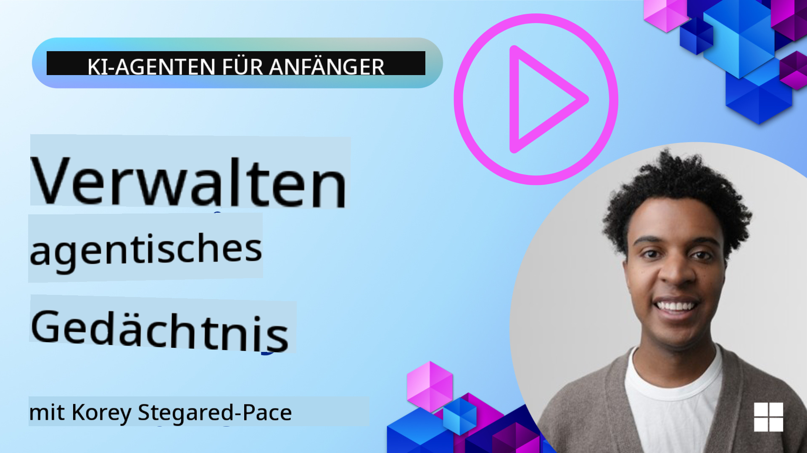

<!--
CO_OP_TRANSLATOR_METADATA:
{
  "original_hash": "c27e2a2e9055910545560e8472b341d8",
  "translation_date": "2025-10-01T21:31:20+00:00",
  "source_file": "13-agent-memory/README.md",
  "language_code": "de"
}
-->
# Speicher für KI-Agenten

Wenn es um die einzigartigen Vorteile der Erstellung von KI-Agenten geht, werden hauptsächlich zwei Dinge diskutiert: die Fähigkeit, Werkzeuge aufzurufen, um Aufgaben zu erledigen, und die Fähigkeit, sich im Laufe der Zeit zu verbessern. Speicher bildet die Grundlage für die Entwicklung selbstverbessernder Agenten, die bessere Erlebnisse für unsere Nutzer schaffen können.

In dieser Lektion werden wir uns ansehen, was Speicher für KI-Agenten bedeutet und wie wir ihn verwalten und für unsere Anwendungen nutzen können.

## Einführung

Diese Lektion behandelt:

• **Verstehen des Speichers von KI-Agenten**: Was Speicher ist und warum er für Agenten essenziell ist.

• **Implementierung und Speicherung von Speicher**: Praktische Methoden, um Speicherfunktionen in Ihre KI-Agenten einzubauen, mit Fokus auf Kurzzeit- und Langzeitspeicher.

• **KI-Agenten selbstverbessernd machen**: Wie Speicher es Agenten ermöglicht, aus vergangenen Interaktionen zu lernen und sich im Laufe der Zeit zu verbessern.

## Lernziele

Nach Abschluss dieser Lektion werden Sie wissen, wie man:

• **Zwischen verschiedenen Arten von KI-Agenten-Speicher unterscheidet**, einschließlich Arbeits-, Kurzzeit- und Langzeitspeicher sowie spezialisierter Formen wie Persona- und episodischer Speicher.

• **Kurzzeit- und Langzeitspeicher für KI-Agenten implementiert und verwaltet**, unter Verwendung des Semantic Kernel Frameworks, mit Tools wie Mem0 und Whiteboard-Speicher sowie der Integration mit Azure AI Search.

• **Die Prinzipien hinter selbstverbessernden KI-Agenten versteht** und wie robuste Speicherverwaltungssysteme zu kontinuierlichem Lernen und Anpassung beitragen.

## Verstehen des Speichers von KI-Agenten

Im Kern bezieht sich **Speicher für KI-Agenten auf Mechanismen, die es ihnen ermöglichen, Informationen zu behalten und abzurufen**. Diese Informationen können spezifische Details über ein Gespräch, Nutzerpräferenzen, vergangene Aktionen oder sogar erlernte Muster sein.

Ohne Speicher sind KI-Anwendungen oft zustandslos, was bedeutet, dass jede Interaktion von vorne beginnt. Dies führt zu einer repetitiven und frustrierenden Nutzererfahrung, bei der der Agent den vorherigen Kontext oder die Präferenzen "vergisst".

### Warum ist Speicher wichtig?

Die Intelligenz eines Agenten hängt stark von seiner Fähigkeit ab, vergangene Informationen abzurufen und zu nutzen. Speicher ermöglicht es Agenten,:

• **Reflektierend** zu sein: Aus vergangenen Aktionen und Ergebnissen zu lernen.

• **Interaktiv** zu sein: Den Kontext über ein laufendes Gespräch hinweg aufrechtzuerhalten.

• **Proaktiv und reaktiv** zu sein: Bedürfnisse vorherzusehen oder angemessen auf Basis historischer Daten zu reagieren.

• **Autonom** zu sein: Unabhängiger zu agieren, indem auf gespeichertes Wissen zurückgegriffen wird.

Das Ziel der Implementierung von Speicher ist es, Agenten **zuverlässiger und fähiger** zu machen.

### Arten von Speicher

#### Arbeitsspeicher

Stellen Sie sich dies wie ein Stück Notizpapier vor, das ein Agent während einer einzelnen, laufenden Aufgabe oder eines Denkprozesses verwendet. Es hält unmittelbare Informationen, die für den nächsten Schritt benötigt werden.

Für KI-Agenten erfasst der Arbeitsspeicher oft die relevantesten Informationen aus einem Gespräch, auch wenn die vollständige Chat-Historie lang oder gekürzt ist. Er konzentriert sich darauf, Schlüsselelemente wie Anforderungen, Vorschläge, Entscheidungen und Aktionen zu extrahieren.

**Beispiel für Arbeitsspeicher**

In einem Reisebuchungs-Agenten könnte der Arbeitsspeicher die aktuelle Anfrage des Nutzers erfassen, wie "Ich möchte eine Reise nach Paris buchen". Diese spezifische Anforderung wird im unmittelbaren Kontext des Agenten gehalten, um die aktuelle Interaktion zu steuern.

#### Kurzzeitspeicher

Diese Art von Speicher behält Informationen für die Dauer eines einzelnen Gesprächs oder einer Sitzung. Es ist der Kontext des aktuellen Chats, der es dem Agenten ermöglicht, auf vorherige Gesprächsbeiträge zurückzugreifen.

**Beispiel für Kurzzeitspeicher**

Wenn ein Nutzer fragt: "Wie viel würde ein Flug nach Paris kosten?" und dann nachfragt: "Was ist mit Unterkünften dort?", stellt der Kurzzeitspeicher sicher, dass der Agent weiß, dass "dort" sich auf "Paris" bezieht, innerhalb desselben Gesprächs.

#### Langzeitspeicher

Dies sind Informationen, die über mehrere Gespräche oder Sitzungen hinweg bestehen bleiben. Sie ermöglichen es Agenten, Nutzerpräferenzen, historische Interaktionen oder allgemeines Wissen über längere Zeiträume hinweg zu speichern. Dies ist wichtig für die Personalisierung.

**Beispiel für Langzeitspeicher**

Ein Langzeitspeicher könnte speichern, dass "Ben gerne Ski fährt und Outdoor-Aktivitäten mag, Kaffee mit Bergblick bevorzugt und aufgrund einer früheren Verletzung fortgeschrittene Skipisten vermeiden möchte". Diese Informationen, die aus früheren Interaktionen gelernt wurden, beeinflussen Empfehlungen in zukünftigen Reiseplanungs-Sitzungen und machen sie hochgradig personalisiert.

#### Persona-Speicher

Dieser spezialisierte Speicher hilft einem Agenten, eine konsistente "Persönlichkeit" oder "Persona" zu entwickeln. Er ermöglicht es dem Agenten, Details über sich selbst oder seine beabsichtigte Rolle zu speichern, wodurch Interaktionen flüssiger und fokussierter werden.

**Beispiel für Persona-Speicher**

Wenn der Reiseagent als "Experte für Ski-Planung" konzipiert ist, könnte der Persona-Speicher diese Rolle verstärken und seine Antworten so beeinflussen, dass sie dem Ton und Wissen eines Experten entsprechen.

#### Workflow/Episodischer Speicher

Dieser Speicher speichert die Abfolge von Schritten, die ein Agent während einer komplexen Aufgabe unternimmt, einschließlich Erfolgen und Misserfolgen. Es ist wie das Erinnern an spezifische "Episoden" oder vergangene Erfahrungen, um daraus zu lernen.

**Beispiel für episodischen Speicher**

Wenn der Agent versucht hat, einen bestimmten Flug zu buchen, dies jedoch aufgrund von Nichtverfügbarkeit scheiterte, könnte der episodische Speicher diesen Misserfolg aufzeichnen, sodass der Agent alternative Flüge ausprobieren oder den Nutzer bei einem späteren Versuch besser über das Problem informieren kann.

#### Entitätsspeicher

Hierbei geht es darum, spezifische Entitäten (wie Personen, Orte oder Dinge) und Ereignisse aus Gesprächen zu extrahieren und zu speichern. Dies ermöglicht es dem Agenten, ein strukturiertes Verständnis der besprochenen Schlüsselelemente aufzubauen.

**Beispiel für Entitätsspeicher**

Aus einem Gespräch über eine vergangene Reise könnte der Agent "Paris", "Eiffelturm" und "Abendessen im Restaurant Le Chat Noir" als Entitäten extrahieren. In einer zukünftigen Interaktion könnte der Agent "Le Chat Noir" abrufen und anbieten, dort eine neue Reservierung vorzunehmen.

#### Strukturierter RAG (Retrieval Augmented Generation)

Während RAG eine umfassendere Technik ist, wird "strukturierter RAG" als eine leistungsstarke Speichertechnologie hervorgehoben. Es extrahiert dichte, strukturierte Informationen aus verschiedenen Quellen (Gesprächen, E-Mails, Bildern) und nutzt sie, um Präzision, Abruf und Geschwindigkeit bei Antworten zu verbessern. Im Gegensatz zu klassischem RAG, das ausschließlich auf semantischer Ähnlichkeit basiert, arbeitet strukturierter RAG mit der inhärenten Struktur von Informationen.

**Beispiel für strukturierten RAG**

Anstatt nur Schlüsselwörter abzugleichen, könnte strukturierter RAG Flugdaten (Ziel, Datum, Uhrzeit, Fluggesellschaft) aus einer E-Mail analysieren und sie strukturiert speichern. Dies ermöglicht präzise Abfragen wie "Welchen Flug habe ich am Dienstag nach Paris gebucht?"

## Implementierung und Speicherung von Speicher

Die Implementierung von Speicher für KI-Agenten umfasst einen systematischen Prozess der **Speicherverwaltung**, der das Generieren, Speichern, Abrufen, Integrieren, Aktualisieren und sogar das "Vergessen" (oder Löschen) von Informationen einschließt. Das Abrufen ist ein besonders entscheidender Aspekt.

### Spezialisierte Speicher-Tools

Eine Möglichkeit, den Speicher eines Agenten zu speichern und zu verwalten, ist die Verwendung spezialisierter Tools wie Mem0. Mem0 fungiert als persistente Speicherschicht, die es Agenten ermöglicht, relevante Interaktionen abzurufen, Nutzerpräferenzen und faktischen Kontext zu speichern und aus Erfolgen und Misserfolgen im Laufe der Zeit zu lernen. Die Idee dahinter ist, dass zustandslose Agenten zu zustandsbehafteten werden.

Es funktioniert durch eine **zweiphasige Speicherpipeline: Extraktion und Aktualisierung**. Zunächst werden Nachrichten, die einem Agenten-Thread hinzugefügt werden, an den Mem0-Dienst gesendet, der ein Large Language Model (LLM) verwendet, um die Gesprächshistorie zusammenzufassen und neue Erinnerungen zu extrahieren. Anschließend bestimmt eine LLM-gesteuerte Aktualisierungsphase, ob diese Erinnerungen hinzugefügt, modifiziert oder gelöscht werden sollen, und speichert sie in einem hybriden Datenspeicher, der Vektor-, Graph- und Schlüssel-Wert-Datenbanken umfassen kann. Dieses System unterstützt auch verschiedene Speicherarten und kann Graph-Speicher für die Verwaltung von Beziehungen zwischen Entitäten einbeziehen.

### Speicher mit RAG speichern

Neben spezialisierten Speicher-Tools wie Mem0 können Sie robuste Suchdienste wie **Azure AI Search als Backend für die Speicherung und das Abrufen von Erinnerungen** nutzen, insbesondere für strukturierten RAG.

Dies ermöglicht es Ihnen, die Antworten Ihres Agenten mit Ihren eigenen Daten zu untermauern und sicherzustellen, dass sie relevanter und genauer sind. Azure AI Search kann verwendet werden, um nutzerspezifische Reiseerinnerungen, Produktkataloge oder andere domänenspezifische Kenntnisse zu speichern.

Azure AI Search unterstützt Funktionen wie **strukturierter RAG**, das sich durch die Extraktion und das Abrufen dichter, strukturierter Informationen aus großen Datensätzen wie Gesprächshistorien, E-Mails oder sogar Bildern auszeichnet. Dies bietet "übermenschliche Präzision und Abruf" im Vergleich zu traditionellen Ansätzen wie Textchunking und Einbettung.

## KI-Agenten selbstverbessernd machen

Ein häufiges Muster für selbstverbessernde Agenten besteht darin, einen **"Wissensagenten"** einzuführen. Dieser separate Agent beobachtet das Hauptgespräch zwischen dem Nutzer und dem primären Agenten. Seine Aufgabe ist es:

1. **Wertvolle Informationen identifizieren**: Feststellen, ob ein Teil des Gesprächs es wert ist, als allgemeines Wissen oder spezifische Nutzerpräferenz gespeichert zu werden.

2. **Extrahieren und zusammenfassen**: Die wesentlichen Erkenntnisse oder Präferenzen aus dem Gespräch destillieren.

3. **In einer Wissensdatenbank speichern**: Diese extrahierten Informationen dauerhaft speichern, oft in einer Vektordatenbank, damit sie später abgerufen werden können.

4. **Zukünftige Abfragen erweitern**: Wenn der Nutzer eine neue Abfrage startet, ruft der Wissensagent relevante gespeicherte Informationen ab und fügt sie der Eingabeaufforderung des Nutzers hinzu, um dem primären Agenten entscheidenden Kontext zu liefern (ähnlich wie RAG).

### Optimierungen für Speicher

• **Latenzmanagement**: Um Benutzerinteraktionen nicht zu verlangsamen, kann zunächst ein günstigeres, schnelleres Modell verwendet werden, um schnell zu prüfen, ob Informationen es wert sind, gespeichert oder abgerufen zu werden, und nur bei Bedarf den komplexeren Extraktions-/Abrufprozess auszulösen.

• **Wissensdatenbank-Wartung**: Für eine wachsende Wissensdatenbank können weniger häufig genutzte Informationen in "Cold Storage" verschoben werden, um Kosten zu verwalten.

## Noch Fragen zum Agentenspeicher?

Treten Sie dem [Azure AI Foundry Discord](https://aka.ms/ai-agents/discord) bei, um sich mit anderen Lernenden auszutauschen, Sprechstunden zu besuchen und Ihre Fragen zu KI-Agenten beantwortet zu bekommen.

---

**Haftungsausschluss**:  
Dieses Dokument wurde mithilfe des KI-Übersetzungsdienstes [Co-op Translator](https://github.com/Azure/co-op-translator) übersetzt. Obwohl wir uns um Genauigkeit bemühen, beachten Sie bitte, dass automatisierte Übersetzungen Fehler oder Ungenauigkeiten enthalten können. Das Originaldokument in seiner ursprünglichen Sprache sollte als maßgebliche Quelle betrachtet werden. Für kritische Informationen wird eine professionelle menschliche Übersetzung empfohlen. Wir übernehmen keine Haftung für Missverständnisse oder Fehlinterpretationen, die sich aus der Nutzung dieser Übersetzung ergeben.