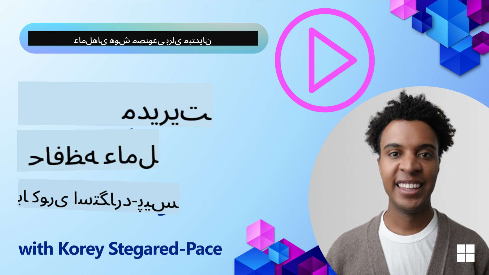

<!--
CO_OP_TRANSLATOR_METADATA:
{
  "original_hash": "d2c9703548140bafa2d6a77406552542",
  "translation_date": "2025-10-03T14:12:55+00:00",
  "source_file": "13-agent-memory/README.md",
  "language_code": "fa"
}
-->
# حافظه برای عوامل هوش مصنوعی

هنگام بحث درباره مزایای منحصر به فرد ایجاد عوامل هوش مصنوعی، دو موضوع اصلی مطرح می‌شود: توانایی استفاده از ابزارها برای انجام وظایف و توانایی بهبود در طول زمان. حافظه اساس ایجاد عاملی است که بتواند خود را بهبود دهد و تجربه‌های بهتری برای کاربران ما ایجاد کند.

در این درس، به بررسی مفهوم حافظه برای عوامل هوش مصنوعی و نحوه مدیریت و استفاده از آن برای بهبود برنامه‌های کاربردی خود خواهیم پرداخت.

## مقدمه

این درس شامل موارد زیر خواهد بود:

• **درک حافظه عامل هوش مصنوعی**: حافظه چیست و چرا برای عوامل ضروری است.

• **پیاده‌سازی و ذخیره حافظه**: روش‌های عملی برای افزودن قابلیت‌های حافظه به عوامل هوش مصنوعی، با تمرکز بر حافظه کوتاه‌مدت و بلندمدت.

• **ایجاد عوامل هوش مصنوعی خودبهبود**: چگونه حافظه به عوامل امکان می‌دهد از تعاملات گذشته یاد بگیرند و در طول زمان بهبود یابند.

## اهداف یادگیری

پس از اتمام این درس، شما قادر خواهید بود:

• **تفاوت بین انواع مختلف حافظه عامل هوش مصنوعی** را تشخیص دهید، از جمله حافظه کاری، کوتاه‌مدت، بلندمدت و انواع خاص مانند حافظه شخصیت و اپیزودیک.

• **پیاده‌سازی و مدیریت حافظه کوتاه‌مدت و بلندمدت برای عوامل هوش مصنوعی** با استفاده از چارچوب Semantic Kernel، ابزارهایی مانند Mem0 و حافظه Whiteboard، و ادغام با Azure AI Search.

• **درک اصول پشت عوامل هوش مصنوعی خودبهبود** و اینکه چگونه سیستم‌های مدیریت حافظه قوی به یادگیری و تطبیق مداوم کمک می‌کنند.

## درک حافظه عامل هوش مصنوعی

در اصل، **حافظه برای عوامل هوش مصنوعی به مکانیزم‌هایی اشاره دارد که به آنها امکان می‌دهد اطلاعات را حفظ و بازیابی کنند**. این اطلاعات می‌تواند جزئیات خاصی درباره یک مکالمه، ترجیحات کاربر، اقدامات گذشته یا حتی الگوهای یادگرفته شده باشد.

بدون حافظه، برنامه‌های هوش مصنوعی اغلب بدون حالت هستند، به این معنی که هر تعامل از ابتدا شروع می‌شود. این منجر به تجربه‌ای تکراری و ناامیدکننده برای کاربر می‌شود که در آن عامل "فراموش" می‌کند زمینه یا ترجیحات قبلی را.

### چرا حافظه مهم است؟

هوش یک عامل به شدت به توانایی آن در یادآوری و استفاده از اطلاعات گذشته وابسته است. حافظه به عوامل امکان می‌دهد:

• **بازتابی**: یادگیری از اقدامات و نتایج گذشته.

• **تعاملی**: حفظ زمینه در طول یک مکالمه مداوم.

• **پیش‌بینی‌کننده و واکنشی**: پیش‌بینی نیازها یا پاسخ مناسب بر اساس داده‌های تاریخی.

• **خودمختار**: عملکرد مستقل‌تر با استفاده از دانش ذخیره‌شده.

هدف از پیاده‌سازی حافظه این است که عوامل را **قابل اعتمادتر و توانمندتر** کنیم.

### انواع حافظه

#### حافظه کاری

این نوع حافظه مانند یک کاغذ یادداشت است که عامل در طول یک وظیفه یا فرآیند تفکر جاری از آن استفاده می‌کند. اطلاعات فوری مورد نیاز برای محاسبه مرحله بعدی را نگه می‌دارد.

برای عوامل هوش مصنوعی، حافظه کاری اغلب اطلاعات مرتبط‌ترین بخش‌های یک مکالمه را ثبت می‌کند، حتی اگر تاریخچه کامل چت طولانی یا کوتاه شده باشد. این حافظه بر استخراج عناصر کلیدی مانند نیازها، پیشنهادات، تصمیمات و اقدامات تمرکز دارد.

**مثال حافظه کاری**

در یک عامل رزرو سفر، حافظه کاری ممکن است درخواست فعلی کاربر را ثبت کند، مانند "می‌خواهم سفری به پاریس رزرو کنم". این نیاز خاص در زمینه فوری عامل نگه داشته می‌شود تا تعامل جاری را هدایت کند.

#### حافظه کوتاه‌مدت

این نوع حافظه اطلاعات را برای مدت زمان یک مکالمه یا جلسه حفظ می‌کند. این زمینه مکالمه جاری است که به عامل امکان می‌دهد به نوبت‌های قبلی در گفتگو ارجاع دهد.

**مثال حافظه کوتاه‌مدت**

اگر کاربر بپرسد، "هزینه پرواز به پاریس چقدر است؟" و سپس ادامه دهد، "اقامت در آنجا چطور؟"، حافظه کوتاه‌مدت تضمین می‌کند که عامل می‌داند "آنجا" به "پاریس" در همان مکالمه اشاره دارد.

#### حافظه بلندمدت

این نوع حافظه اطلاعاتی است که در طول چندین مکالمه یا جلسه باقی می‌ماند. این حافظه به عوامل امکان می‌دهد ترجیحات کاربر، تعاملات تاریخی یا دانش عمومی را در طول زمان‌های طولانی به یاد داشته باشند. این برای شخصی‌سازی مهم است.

**مثال حافظه بلندمدت**

یک حافظه بلندمدت ممکن است ذخیره کند که "بن از اسکی و فعالیت‌های بیرون از خانه لذت می‌برد، قهوه با منظره کوه را دوست دارد و می‌خواهد از شیب‌های اسکی پیشرفته به دلیل یک آسیب قبلی اجتناب کند". این اطلاعات، که از تعاملات قبلی یاد گرفته شده است، توصیه‌ها را در جلسات برنامه‌ریزی سفر آینده بسیار شخصی‌سازی می‌کند.

#### حافظه شخصیت

این نوع حافظه خاص به عامل کمک می‌کند یک "شخصیت" یا "نقش" ثابت ایجاد کند. این حافظه به عامل امکان می‌دهد جزئیات مربوط به خود یا نقش مورد نظرش را به یاد داشته باشد، و تعاملات را روان‌تر و متمرکزتر کند.

**مثال حافظه شخصیت**

اگر عامل سفر طراحی شده باشد تا یک "برنامه‌ریز اسکی متخصص" باشد، حافظه شخصیت ممکن است این نقش را تقویت کند و پاسخ‌های آن را به گونه‌ای تنظیم کند که با لحن و دانش یک متخصص هماهنگ باشد.

#### حافظه اپیزودیک/جریان کاری

این حافظه دنباله‌ای از مراحل را که عامل در طول یک وظیفه پیچیده انجام می‌دهد، از جمله موفقیت‌ها و شکست‌ها، ذخیره می‌کند. این حافظه مانند یادآوری "اپیزودها" یا تجربیات گذشته برای یادگیری از آنها است.

**مثال حافظه اپیزودیک**

اگر عامل تلاش کند یک پرواز خاص را رزرو کند اما به دلیل عدم موجودی شکست بخورد، حافظه اپیزودیک می‌تواند این شکست را ثبت کند و به عامل امکان دهد پروازهای جایگزین را امتحان کند یا کاربر را در تلاش بعدی به طور آگاهانه‌تر از مشکل مطلع کند.

#### حافظه موجودیت

این حافظه شامل استخراج و به یادآوری موجودیت‌های خاص (مانند افراد، مکان‌ها یا اشیاء) و رویدادها از مکالمات است. این حافظه به عامل امکان می‌دهد درک ساختاری از عناصر کلیدی مورد بحث ایجاد کند.

**مثال حافظه موجودیت**

از یک مکالمه درباره یک سفر گذشته، عامل ممکن است "پاریس"، "برج ایفل"، و "شام در رستوران Le Chat Noir" را به عنوان موجودیت‌ها استخراج کند. در یک تعامل آینده، عامل می‌تواند "Le Chat Noir" را به یاد بیاورد و پیشنهاد دهد که یک رزرو جدید در آنجا انجام دهد.

#### RAG ساختاریافته (تولید تقویت‌شده با بازیابی)

در حالی که RAG یک تکنیک گسترده‌تر است، "RAG ساختاریافته" به عنوان یک فناوری حافظه قدرتمند برجسته شده است. این تکنیک اطلاعات متراکم و ساختاریافته را از منابع مختلف (مکالمات، ایمیل‌ها، تصاویر) استخراج می‌کند و از آن برای افزایش دقت، بازیابی و سرعت در پاسخ‌ها استفاده می‌کند. برخلاف RAG کلاسیک که تنها به شباهت معنایی متکی است، RAG ساختاریافته با ساختار ذاتی اطلاعات کار می‌کند.

**مثال RAG ساختاریافته**

به جای تطبیق صرفاً کلمات کلیدی، RAG ساختاریافته می‌تواند جزئیات پرواز (مقصد، تاریخ، زمان، شرکت هواپیمایی) را از یک ایمیل استخراج کند و آنها را به صورت ساختاریافته ذخیره کند. این امکان پرسش‌های دقیق مانند "چه پروازی به پاریس در روز سه‌شنبه رزرو کردم؟" را فراهم می‌کند.

## پیاده‌سازی و ذخیره حافظه

پیاده‌سازی حافظه برای عوامل هوش مصنوعی شامل یک فرآیند سیستماتیک **مدیریت حافظه** است که شامل تولید، ذخیره، بازیابی، ادغام، به‌روزرسانی و حتی "فراموش کردن" (یا حذف) اطلاعات می‌شود. بازیابی به‌ویژه جنبه‌ای حیاتی است.

### ابزارهای حافظه خاص

یکی از راه‌های ذخیره و مدیریت حافظه عامل استفاده از ابزارهای خاص مانند Mem0 است. Mem0 به عنوان یک لایه حافظه پایدار عمل می‌کند و به عوامل امکان می‌دهد تعاملات مرتبط را به یاد بیاورند، ترجیحات کاربر و زمینه‌های واقعی را ذخیره کنند و از موفقیت‌ها و شکست‌ها در طول زمان یاد بگیرند. ایده این است که عوامل بدون حالت به عوامل دارای حالت تبدیل شوند.

این ابزار از طریق یک **خط لوله حافظه دو مرحله‌ای: استخراج و به‌روزرسانی** کار می‌کند. ابتدا، پیام‌هایی که به رشته عامل اضافه می‌شوند به سرویس Mem0 ارسال می‌شوند، که از یک مدل زبان بزرگ (LLM) برای خلاصه‌سازی تاریخچه مکالمه و استخراج حافظه‌های جدید استفاده می‌کند. سپس، یک مرحله به‌روزرسانی مبتنی بر LLM تعیین می‌کند که آیا این حافظه‌ها باید اضافه، اصلاح یا حذف شوند و آنها را در یک ذخیره داده ترکیبی که می‌تواند شامل پایگاه‌های داده برداری، گراف و کلید-مقدار باشد ذخیره می‌کند. این سیستم همچنین از انواع مختلف حافظه پشتیبانی می‌کند و می‌تواند حافظه گراف را برای مدیریت روابط بین موجودیت‌ها ادغام کند.

### ذخیره حافظه با RAG

فراتر از ابزارهای حافظه خاص مانند Mem0، می‌توانید از خدمات جستجوی قدرتمند مانند **Azure AI Search به عنوان بک‌اند برای ذخیره و بازیابی حافظه‌ها** استفاده کنید، به‌ویژه برای RAG ساختاریافته.

این امکان را فراهم می‌کند که پاسخ‌های عامل خود را با داده‌های خودتان پایه‌گذاری کنید و پاسخ‌های مرتبط‌تر و دقیق‌تری ارائه دهید. Azure AI Search می‌تواند برای ذخیره حافظه‌های سفر کاربر، کاتالوگ‌های محصول یا هر دانش خاص دامنه دیگر استفاده شود.

Azure AI Search قابلیت‌هایی مانند **RAG ساختاریافته** را پشتیبانی می‌کند که در استخراج و بازیابی اطلاعات متراکم و ساختاریافته از مجموعه داده‌های بزرگ مانند تاریخچه مکالمات، ایمیل‌ها یا حتی تصاویر برتری دارد. این قابلیت "دقت و بازیابی فوق انسانی" را در مقایسه با روش‌های سنتی تقسیم متن و جاسازی فراهم می‌کند.

## ایجاد عوامل هوش مصنوعی خودبهبود

یک الگوی رایج برای عوامل خودبهبود شامل معرفی یک **"عامل دانش"** است. این عامل جداگانه مکالمه اصلی بین کاربر و عامل اصلی را مشاهده می‌کند. نقش آن شامل موارد زیر است:

1. **شناسایی اطلاعات ارزشمند**: تعیین اینکه آیا بخشی از مکالمه ارزش ذخیره به عنوان دانش عمومی یا ترجیح خاص کاربر را دارد.

2. **استخراج و خلاصه‌سازی**: استخراج یادگیری یا ترجیح ضروری از مکالمه.

3. **ذخیره در پایگاه دانش**: ذخیره این اطلاعات استخراج‌شده، اغلب در یک پایگاه داده برداری، به‌طوری که بتوان آن را بعداً بازیابی کرد.

4. **تقویت پرسش‌های آینده**: هنگامی که کاربر یک پرسش جدید را آغاز می‌کند، عامل دانش اطلاعات ذخیره‌شده مرتبط را بازیابی کرده و آن را به درخواست کاربر اضافه می‌کند، زمینه‌ای حیاتی برای عامل اصلی فراهم می‌کند (مشابه RAG).

### بهینه‌سازی‌ها برای حافظه

• **مدیریت تأخیر**: برای جلوگیری از کند شدن تعاملات کاربر، می‌توان ابتدا از یک مدل ارزان‌تر و سریع‌تر استفاده کرد تا به سرعت بررسی کند که آیا اطلاعات ارزش ذخیره یا بازیابی را دارد، و فقط در صورت لزوم فرآیند استخراج/بازیابی پیچیده‌تر را فراخوانی کرد.

• **نگهداری پایگاه دانش**: برای یک پایگاه دانش در حال رشد، اطلاعاتی که کمتر استفاده می‌شوند می‌توانند به "ذخیره سرد" منتقل شوند تا هزینه‌ها مدیریت شوند.

## سوالات بیشتری درباره حافظه عامل دارید؟

به [Discord Azure AI Foundry](https://aka.ms/ai-agents/discord) بپیوندید تا با دیگر یادگیرندگان ملاقات کنید، در ساعات اداری شرکت کنید و سوالات خود درباره عوامل هوش مصنوعی را پاسخ دهید.

---

**سلب مسئولیت**:  
این سند با استفاده از سرویس ترجمه هوش مصنوعی [Co-op Translator](https://github.com/Azure/co-op-translator) ترجمه شده است. در حالی که ما تلاش می‌کنیم ترجمه‌ها دقیق باشند، لطفاً توجه داشته باشید که ترجمه‌های خودکار ممکن است شامل خطاها یا نادرستی‌ها باشند. سند اصلی به زبان اصلی آن باید به عنوان منبع معتبر در نظر گرفته شود. برای اطلاعات حساس، توصیه می‌شود از ترجمه انسانی حرفه‌ای استفاده کنید. ما هیچ مسئولیتی در قبال سوء تفاهم‌ها یا تفسیرهای نادرست ناشی از استفاده از این ترجمه نداریم.