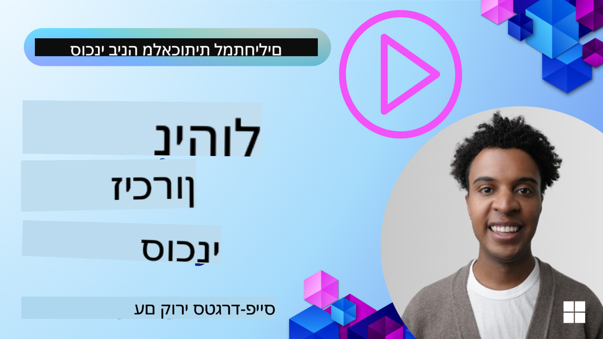

<!--
CO_OP_TRANSLATOR_METADATA:
{
  "original_hash": "c27e2a2e9055910545560e8472b341d8",
  "translation_date": "2025-10-02T17:14:05+00:00",
  "source_file": "13-agent-memory/README.md",
  "language_code": "he"
}
-->
# זיכרון לסוכני AI  

כשמדברים על היתרונות הייחודיים של יצירת סוכני AI, שני דברים עיקריים עולים לדיון: היכולת להשתמש בכלים לביצוע משימות והיכולת להשתפר עם הזמן. זיכרון הוא הבסיס ליצירת סוכן שמשתפר בעצמו ויכול לספק חוויות טובות יותר למשתמשים שלנו.

בשיעור הזה, נבחן מהו זיכרון עבור סוכני AI, כיצד ניתן לנהל אותו ולהשתמש בו לטובת האפליקציות שלנו.

## מבוא  

השיעור הזה יעסוק ב:  

• **הבנת זיכרון סוכן AI**: מהו זיכרון ולמה הוא חיוני עבור סוכנים.  

• **יישום ואחסון זיכרון**: שיטות מעשיות להוספת יכולות זיכרון לסוכני AI, עם דגש על זיכרון קצר טווח וארוך טווח.  

• **הפיכת סוכני AI למשתפרים בעצמם**: כיצד זיכרון מאפשר לסוכנים ללמוד מאינטראקציות קודמות ולהשתפר עם הזמן.  

## מטרות למידה  

לאחר השלמת השיעור, תדעו כיצד:  

• **להבחין בין סוגי זיכרון שונים של סוכני AI**, כולל זיכרון עבודה, זיכרון קצר טווח, זיכרון ארוך טווח וצורות מיוחדות כמו זיכרון פרסונה וזיכרון אפיזודי.  

• **ליישם ולנהל זיכרון קצר טווח וארוך טווח עבור סוכני AI** באמצעות מסגרת Semantic Kernel, תוך שימוש בכלים כמו Mem0 וזיכרון Whiteboard, ושילוב עם Azure AI Search.  

• **להבין את העקרונות מאחורי סוכני AI שמשתפרים בעצמם** וכיצד מערכות ניהול זיכרון חזקות תורמות ללמידה והתאמה מתמשכת.  

## הבנת זיכרון סוכן AI  

בבסיסו, **זיכרון עבור סוכני AI מתייחס למנגנונים שמאפשרים להם לשמור ולהיזכר במידע**. מידע זה יכול להיות פרטים ספציפיים על שיחה, העדפות משתמש, פעולות קודמות או אפילו דפוסים שנלמדו.  

ללא זיכרון, אפליקציות AI הן לרוב חסרות מצב, כלומר כל אינטראקציה מתחילה מאפס. זה מוביל לחוויית משתמש חוזרת ומתסכלת שבה הסוכן "שוכח" הקשר או העדפות קודמות.  

### למה זיכרון חשוב?  

האינטליגנציה של סוכן קשורה באופן עמוק ליכולתו להיזכר ולהשתמש במידע מהעבר. זיכרון מאפשר לסוכנים להיות:  

• **רפלקטיביים**: ללמוד מפעולות ותוצאות קודמות.  

• **אינטראקטיביים**: לשמור הקשר במהלך שיחה מתמשכת.  

• **פרואקטיביים וריאקטיביים**: לצפות צרכים או להגיב בצורה מתאימה על סמך נתונים היסטוריים.  

• **אוטונומיים**: לפעול בצורה עצמאית יותר על ידי שימוש בידע שנשמר.  

המטרה של יישום זיכרון היא להפוך את הסוכנים ליותר **אמינים ומסוגלים**.  

### סוגי זיכרון  

#### זיכרון עבודה  

חשבו על זה כמו דף טיוטה שהסוכן משתמש בו במהלך משימה או תהליך מחשבה יחיד. הוא מחזיק מידע מיידי שדרוש לחישוב הצעד הבא.  

עבור סוכני AI, זיכרון עבודה לרוב לוכד את המידע הרלוונטי ביותר משיחה, גם אם היסטוריית הצ'אט המלאה ארוכה או מקוצרת. הוא מתמקד בהפקת אלמנטים מרכזיים כמו דרישות, הצעות, החלטות ופעולות.  

**דוגמה לזיכרון עבודה**  

בסוכן הזמנת נסיעות, זיכרון עבודה עשוי ללכוד את הבקשה הנוכחית של המשתמש, כמו "אני רוצה להזמין טיול לפריז". דרישה ספציפית זו נשמרת בהקשר המיידי של הסוכן כדי להנחות את האינטראקציה הנוכחית.  

#### זיכרון קצר טווח  

סוג זה של זיכרון שומר מידע למשך שיחה או סשן יחיד. זהו ההקשר של הצ'אט הנוכחי, שמאפשר לסוכן להתייחס חזרה לפניות קודמות בדיאלוג.  

**דוגמה לזיכרון קצר טווח**  

אם משתמש שואל, "כמה עולה טיסה לפריז?" ואז ממשיך עם "ומה לגבי לינה שם?", זיכרון קצר טווח מבטיח שהסוכן יודע ש"שם" מתייחס ל"פריז" בתוך אותה שיחה.  

#### זיכרון ארוך טווח  

זהו מידע שנשמר לאורך מספר שיחות או סשנים. הוא מאפשר לסוכנים לזכור העדפות משתמש, אינטראקציות היסטוריות או ידע כללי לאורך תקופות ממושכות. זה חשוב להתאמה אישית.  

**דוגמה לזיכרון ארוך טווח**  

זיכרון ארוך טווח עשוי לשמור ש"בן אוהב סקי ופעילויות חוץ, אוהב קפה עם נוף הררי, ורוצה להימנע ממסלולי סקי מתקדמים בגלל פציעה קודמת". מידע זה, שנלמד מאינטראקציות קודמות, משפיע על המלצות בתכנון נסיעות עתידי, מה שהופך אותן לאישיות מאוד.  

#### זיכרון פרסונה  

סוג זיכרון מיוחד זה עוזר לסוכן לפתח "אישיות" או "פרסונה" עקבית. הוא מאפשר לסוכן לזכור פרטים על עצמו או על תפקידו המיועד, מה שהופך את האינטראקציות ליותר זורמות וממוקדות.  

**דוגמה לזיכרון פרסונה**  

אם סוכן הנסיעות מתוכנן להיות "מתכנן סקי מומחה", זיכרון פרסונה עשוי לחזק את התפקיד הזה, ולהשפיע על תגובותיו כך שיתאימו לטון ולידע של מומחה.  

#### זיכרון אפיזודי/תהליכי  

זיכרון זה שומר את רצף הצעדים שסוכן נוקט במהלך משימה מורכבת, כולל הצלחות וכישלונות. זה כמו לזכור "פרקים" או חוויות קודמות כדי ללמוד מהם.  

**דוגמה לזיכרון אפיזודי**  

אם הסוכן ניסה להזמין טיסה מסוימת אך נכשל בגלל חוסר זמינות, זיכרון אפיזודי יכול לתעד את הכישלון הזה, ולאפשר לסוכן לנסות טיסות חלופיות או ליידע את המשתמש על הבעיה בצורה מושכלת יותר בניסיון הבא.  

#### זיכרון ישויות  

זה כולל חילוץ ושמירה של ישויות ספציפיות (כמו אנשים, מקומות או דברים) ואירועים משיחות. זה מאפשר לסוכן לבנות הבנה מובנית של אלמנטים מרכזיים שנדונו.  

**דוגמה לזיכרון ישויות**  

משיחה על טיול קודם, הסוכן עשוי לחלץ "פריז", "מגדל אייפל" ו"ארוחת ערב במסעדת Le Chat Noir" כישויות. באינטראקציה עתידית, הסוכן יכול להיזכר ב-"Le Chat Noir" ולהציע להזמין שם שוב.  

#### RAG מובנה (Structured Retrieval Augmented Generation)  

בעוד ש-RAG היא טכניקה רחבה יותר, "RAG מובנה" מודגש כטכנולוגיית זיכרון חזקה. הוא מחלץ מידע צפוף ומובנה ממקורות שונים (שיחות, מיילים, תמונות) ומשתמש בו לשיפור דיוק, זיכרון ומהירות בתגובות. בניגוד ל-RAG קלאסי שמסתמך רק על דמיון סמנטי, RAG מובנה עובד עם המבנה הפנימי של המידע.  

**דוגמה ל-RAG מובנה**  

במקום רק להתאים מילות מפתח, RAG מובנה יכול לנתח פרטי טיסה (יעד, תאריך, שעה, חברת תעופה) ממייל ולאחסן אותם בצורה מובנית. זה מאפשר שאילתות מדויקות כמו "איזו טיסה הזמנתי לפריז ביום שלישי?"  

## יישום ואחסון זיכרון  

יישום זיכרון עבור סוכני AI כולל תהליך שיטתי של **ניהול זיכרון**, שכולל יצירה, אחסון, שליפה, שילוב, עדכון ואפילו "שכחה" (או מחיקה) של מידע. שליפה היא היבט קריטי במיוחד.  

### כלים מיוחדים לניהול זיכרון  

אחת הדרכים לאחסן ולנהל זיכרון סוכן היא באמצעות כלים מיוחדים כמו Mem0. Mem0 פועל כשכבת זיכרון מתמשכת, שמאפשרת לסוכנים להיזכר באינטראקציות רלוונטיות, לאחסן העדפות משתמש והקשר עובדתי, וללמוד מהצלחות וכישלונות לאורך זמן. הרעיון כאן הוא שסוכנים חסרי מצב הופכים לבעלי מצב.  

הוא פועל דרך **צינור זיכרון דו-שלבי: חילוץ ועדכון**. תחילה, הודעות שנוספו לשרשור של הסוכן נשלחות לשירות Mem0, שמשתמש במודל שפה גדול (LLM) כדי לסכם את היסטוריית השיחה ולחלץ זיכרונות חדשים. לאחר מכן, שלב עדכון מונע-LLM קובע האם להוסיף, לשנות או למחוק את הזיכרונות הללו, ומאחסן אותם במאגר נתונים היברידי שיכול לכלול וקטור, גרף ומאגרי נתונים מבוססי מפתח-ערך. מערכת זו גם תומכת בסוגי זיכרון שונים ויכולה לשלב זיכרון גרפי לניהול קשרים בין ישויות.  

### אחסון זיכרון עם RAG  

מעבר לכלים מיוחדים כמו Mem0, ניתן להשתמש בשירותי חיפוש חזקים כמו **Azure AI Search כ-backend לאחסון ושליפת זיכרונות**, במיוחד עבור RAG מובנה.  

זה מאפשר להניח את תגובות הסוכן על נתונים שלכם, ולהבטיח תשובות רלוונטיות ומדויקות יותר. Azure AI Search יכול לשמש לאחסון זיכרונות נסיעה ספציפיים למשתמש, קטלוגי מוצרים או כל ידע ספציפי לתחום.  

Azure AI Search תומך ביכולות כמו **RAG מובנה**, שמצטיין בחילוץ ושליפת מידע צפוף ומובנה ממאגרי נתונים גדולים כמו היסטוריות שיחות, מיילים או אפילו תמונות. זה מספק "דיוק וזיכרון על-אנושיים" בהשוואה לגישות מסורתיות של חיתוך טקסט והטמעה.  

## הפיכת סוכני AI למשתפרים בעצמם  

תבנית נפוצה עבור סוכנים שמשתפרים בעצמם כוללת הכנסת **"סוכן ידע"**. סוכן נפרד זה צופה בשיחה הראשית בין המשתמש לסוכן הראשי. תפקידו הוא:  

1. **לזהות מידע בעל ערך**: לקבוע אם חלק מהשיחה שווה לשמור כידע כללי או כהעדפת משתמש ספציפית.  

2. **לחלץ ולסכם**: לזקק את הלמידה או ההעדפה החשובה מהשיחה.  

3. **לאחסן בבסיס ידע**: לשמר את המידע שהופק, לרוב במאגר נתונים וקטורי, כך שניתן יהיה לשלוף אותו מאוחר יותר.  

4. **להעשיר שאילתות עתידיות**: כאשר המשתמש מתחיל שאילתה חדשה, סוכן הידע שולף מידע רלוונטי שנשמר ומוסיף אותו להנחיית המשתמש, ומספק הקשר חיוני לסוכן הראשי (בדומה ל-RAG).  

### אופטימיזציות לזיכרון  

• **ניהול זמן תגובה**: כדי להימנע מהאטת אינטראקציות משתמש, ניתן להשתמש במודל זול ומהיר יותר בתחילה כדי לבדוק במהירות אם מידע שווה לשמור או לשלוף, ולהפעיל את תהליך החילוץ/שליפה המורכב רק כשצריך.  

• **תחזוקת בסיס ידע**: עבור בסיס ידע שגדל, מידע שמשתמשים בו פחות לעיתים יכול לעבור ל"אחסון קר" כדי לנהל עלויות.  

## יש לכם עוד שאלות על זיכרון סוכן?  

הצטרפו ל-[Azure AI Foundry Discord](https://aka.ms/ai-agents/discord) כדי לפגוש לומדים אחרים, להשתתף בשעות קבלה ולקבל תשובות לשאלות שלכם על סוכני AI.  

---

**כתב ויתור**:  
מסמך זה תורגם באמצעות שירות תרגום מבוסס בינה מלאכותית [Co-op Translator](https://github.com/Azure/co-op-translator). למרות שאנו שואפים לדיוק, יש לקחת בחשבון שתרגומים אוטומטיים עשויים להכיל שגיאות או אי דיוקים. המסמך המקורי בשפתו המקורית צריך להיחשב כמקור סמכותי. עבור מידע קריטי, מומלץ להשתמש בתרגום מקצועי על ידי אדם. איננו נושאים באחריות לאי הבנות או לפרשנויות שגויות הנובעות משימוש בתרגום זה.