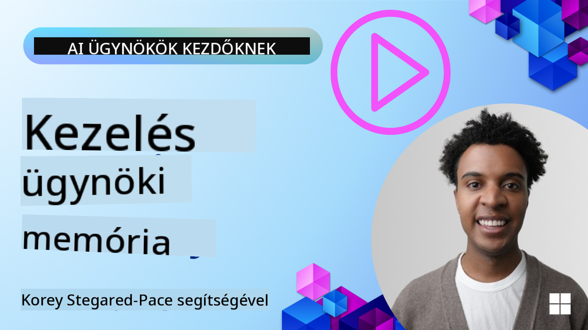

<!--
CO_OP_TRANSLATOR_METADATA:
{
  "original_hash": "d2c9703548140bafa2d6a77406552542",
  "translation_date": "2025-10-03T15:00:12+00:00",
  "source_file": "13-agent-memory/README.md",
  "language_code": "hu"
}
-->
# Memória az AI ügynökök számára

Az AI ügynökök létrehozásának egyedi előnyeiről szóló beszélgetések során két fő dolog kerül előtérbe: az eszközök használatának képessége a feladatok elvégzéséhez, valamint az idővel történő fejlődés képessége. A memória az alapja annak, hogy önfejlesztő ügynököket hozzunk létre, amelyek jobb élményeket nyújthatnak a felhasználóink számára.

Ebben a leckében megvizsgáljuk, mi is az AI ügynökök memóriája, hogyan kezelhetjük és használhatjuk azt alkalmazásaink javára.

## Bevezetés

Ez a lecke az alábbiakat fogja tárgyalni:

• **Az AI ügynök memória megértése**: Mi a memória, és miért elengedhetetlen az ügynökök számára.

• **Memória megvalósítása és tárolása**: Gyakorlati módszerek az AI ügynökök memória képességeinek hozzáadására, különös tekintettel a rövid távú és hosszú távú memóriára.

• **Önfejlesztő AI ügynökök létrehozása**: Hogyan teszi lehetővé a memória az ügynökök számára, hogy tanuljanak a korábbi interakciókból és idővel fejlődjenek.

## Tanulási célok

A lecke elvégzése után képes leszel:

• **Megkülönböztetni az AI ügynök memória különböző típusait**, beleértve a munkamemóriát, rövid távú és hosszú távú memóriát, valamint a speciális formákat, mint például a személyiség- és epizodikus memória.

• **Rövid távú és hosszú távú memória megvalósítása és kezelése AI ügynökök számára** a Semantic Kernel keretrendszer segítségével, olyan eszközök használatával, mint a Mem0 és a Whiteboard memória, valamint az Azure AI Search integrálásával.

• **Az önfejlesztő AI ügynökök mögötti elvek megértése**, és hogyan járulnak hozzá a robusztus memória-kezelési rendszerek a folyamatos tanuláshoz és alkalmazkodáshoz.

## Az AI ügynök memória megértése

Alapvetően **az AI ügynökök memóriája azokat a mechanizmusokat jelenti, amelyek lehetővé teszik számukra az információk megőrzését és visszahívását**. Ezek az információk lehetnek konkrét részletek egy beszélgetésről, felhasználói preferenciák, korábbi cselekvések vagy akár tanult minták.

Memória nélkül az AI alkalmazások gyakran állapotmentesek, ami azt jelenti, hogy minden interakció nulláról indul. Ez ismétlődő és frusztráló felhasználói élményhez vezet, ahol az ügynök "elfelejti" a korábbi kontextust vagy preferenciákat.

### Miért fontos a memória?

Az ügynök intelligenciája szorosan összefügg azzal, hogy képes-e visszahívni és felhasználni a korábbi információkat. A memória lehetővé teszi az ügynökök számára, hogy:

• **Reflektívak legyenek**: Tanuljanak a korábbi cselekvésekből és eredményekből.

• **Interaktívak legyenek**: Fenntartsák a kontextust egy folyamatban lévő beszélgetés során.

• **Proaktívak és reaktívak legyenek**: Előre jelezzék az igényeket vagy megfelelően reagáljanak a történeti adatok alapján.

• **Autonómak legyenek**: Függetlenebbül működjenek a tárolt tudás felhasználásával.

A memória megvalósításának célja, hogy az ügynökök megbízhatóbbak és képesebbek legyenek.

### Memóriatípusok

#### Munkamemória

Gondolj rá úgy, mint egy darab jegyzetpapírra, amelyet az ügynök egyetlen, folyamatban lévő feladat vagy gondolatmenet során használ. Ez tartalmazza az azonnali információkat, amelyek szükségesek a következő lépés kiszámításához.

Az AI ügynökök esetében a munkamemória gyakran a beszélgetés legrelevánsabb információit rögzíti, még akkor is, ha a teljes csevegési előzmény hosszú vagy csonkolt. A kulcselemek, mint például követelmények, javaslatok, döntések és cselekvések kivonására összpontosít.

**Munkamemória példa**

Egy utazási foglalási ügynök esetében a munkamemória rögzítheti a felhasználó aktuális kérését, például: "Szeretnék egy utat foglalni Párizsba." Ez a konkrét követelmény az ügynök azonnali kontextusában marad, hogy irányítsa a jelenlegi interakciót.

#### Rövid távú memória

Ez a memória egyetlen beszélgetés vagy munkamenet idejére őrzi meg az információkat. Ez a jelenlegi csevegés kontextusa, amely lehetővé teszi az ügynök számára, hogy visszautaljon a párbeszéd korábbi fordulataira.

**Rövid távú memória példa**

Ha egy felhasználó megkérdezi: "Mennyibe kerülne egy repülőjegy Párizsba?" majd folytatja: "Mi a helyzet az ottani szállással?", a rövid távú memória biztosítja, hogy az ügynök tudja, hogy az "ott" Párizsra utal ugyanazon beszélgetésen belül.

#### Hosszú távú memória

Ez az információ több beszélgetésen vagy munkameneten keresztül fennmarad. Lehetővé teszi az ügynökök számára, hogy emlékezzenek a felhasználói preferenciákra, történeti interakciókra vagy általános tudásra hosszabb időszakon keresztül. Ez fontos a személyre szabás szempontjából.

**Hosszú távú memória példa**

A hosszú távú memória tárolhatja, hogy "Ben szeret síelni és szabadtéri tevékenységeket végezni, szereti a kávét hegyi kilátással, és el akarja kerülni a haladó sípályákat egy korábbi sérülés miatt". Ez az információ, amelyet korábbi interakciókból tanult, befolyásolja a javaslatokat a jövőbeli utazástervezési munkamenetek során, rendkívül személyre szabottá téve azokat.

#### Személyiség memória

Ez a speciális memória típus segít az ügynöknek egy következetes "személyiség" vagy "szerep" kialakításában. Lehetővé teszi az ügynök számára, hogy emlékezzen önmagára vagy a szándékolt szerepére, így az interakciók gördülékenyebbek és fókuszáltabbak lesznek.

**Személyiség memória példa**

Ha az utazási ügynököt "síelési szakértőként" tervezték meg, a személyiség memória megerősítheti ezt a szerepet, befolyásolva a válaszait, hogy azok egy szakértő hangneméhez és tudásához igazodjanak.

#### Munkafolyamat/Epizodikus memória

Ez a memória tárolja az ügynök által egy összetett feladat során végrehajtott lépések sorozatát, beleértve a sikereket és kudarcokat. Olyan, mintha az ügynök "epizódokat" vagy korábbi tapasztalatokat emlékezne meg, hogy tanuljon belőlük.

**Epizodikus memória példa**

Ha az ügynök megpróbált lefoglalni egy konkrét járatot, de az nem sikerült elérhetőség hiánya miatt, az epizodikus memória rögzítheti ezt a kudarcot, lehetővé téve az ügynök számára, hogy alternatív járatokat próbáljon ki, vagy tájékoztassa a felhasználót a problémáról egy következő próbálkozás során.

#### Entitás memória

Ez magában foglalja konkrét entitások (például emberek, helyek vagy dolgok) és események kivonását és megjegyzését a beszélgetésekből. Lehetővé teszi az ügynök számára, hogy strukturált megértést építsen ki a megbeszélt kulcselemekről.

**Entitás memória példa**

Egy korábbi utazásról szóló beszélgetésből az ügynök kivonhatja "Párizs", "Eiffel-torony" és "vacsora a Le Chat Noir étteremben" entitásokat. Egy jövőbeli interakció során az ügynök emlékezhet a "Le Chat Noir"-ra, és felajánlhatja, hogy új foglalást készít ott.

#### Strukturált RAG (Retrieval Augmented Generation)

Míg a RAG egy általános technika, a "Strukturált RAG" kiemelkedik, mint egy erőteljes memória technológia. Sűrű, strukturált információkat von ki különböző forrásokból (beszélgetések, e-mailek, képek), és ezeket használja a válaszok pontosságának, visszahívásának és sebességének növelésére. A klasszikus RAG-tól eltérően, amely kizárólag szemantikai hasonlóságra támaszkodik, a Strukturált RAG az információk belső struktúrájával dolgozik.

**Strukturált RAG példa**

Ahelyett, hogy csak kulcsszavakat párosítana, a Strukturált RAG képes lenne repülési részleteket (célállomás, dátum, idő, légitársaság) elemezni egy e-mailből, és strukturált módon tárolni azokat. Ez lehetővé teszi a pontos lekérdezéseket, például: "Melyik járatot foglaltam Párizsba kedden?"

## Memória megvalósítása és tárolása

Az AI ügynökök memóriájának megvalósítása egy **memóriakezelési** folyamatot foglal magában, amely magában foglalja az információk generálását, tárolását, visszakeresését, integrálását, frissítését, sőt "elfelejtését" (vagy törlését). A visszakeresés különösen kritikus szempont.

### Speciális memória eszközök

Az ügynök memória tárolásának és kezelésének egyik módja speciális eszközök, például a Mem0 használata. A Mem0 egy tartós memória rétegként működik, amely lehetővé teszi az ügynökök számára, hogy releváns interakciókat hívjanak vissza, felhasználói preferenciákat és ténybeli kontextust tároljanak, valamint tanuljanak a sikerekből és kudarcokból az idő múlásával. Az ötlet az, hogy az állapotmentes ügynökök állapotossá váljanak.

Ez egy **kétfázisú memóriafolyamaton** keresztül működik: kivonás és frissítés. Először az ügynök szálához hozzáadott üzeneteket elküldik a Mem0 szolgáltatásnak, amely egy Nagy Nyelvi Modell (LLM) segítségével összefoglalja a beszélgetési előzményeket és új emlékeket von ki. Ezt követően egy LLM-alapú frissítési fázis határozza meg, hogy hozzáadja, módosítja vagy törli ezeket az emlékeket, és hibrid adatbázisban tárolja őket, amely tartalmazhat vektor-, gráf- és kulcs-érték adatbázisokat. Ez a rendszer különböző memória típusokat is támogat, és integrálhat gráf memóriát az entitások közötti kapcsolatok kezelésére.

### Memória tárolása RAG segítségével

A Mem0-hoz hasonló speciális memória eszközökön túl robusztus keresési szolgáltatásokat is használhatsz, például **Azure AI Search-t a memória tárolására és visszakeresésére**, különösen a strukturált RAG esetében.

Ez lehetővé teszi, hogy az ügynök válaszait a saját adataiddal alapozd meg, biztosítva a relevánsabb és pontosabb válaszokat. Az Azure AI Search használható felhasználóspecifikus utazási emlékek, termékkatalógusok vagy bármilyen más domain-specifikus tudás tárolására.

Az Azure AI Search támogatja a **Strukturált RAG** képességeit, amely kiválóan alkalmas sűrű, strukturált információk kivonására és visszakeresésére nagy adathalmazokból, például beszélgetési előzményekből, e-mailekből vagy akár képekből. Ez "emberfeletti pontosságot és visszahívást" biztosít a hagyományos szövegdarabolási és beágyazási megközelítésekhez képest.

## Az AI ügynökök önfejlesztése

Az önfejlesztő ügynökök gyakori mintája egy **"tudás ügynök"** bevezetése. Ez a különálló ügynök megfigyeli a fő beszélgetést a felhasználó és az elsődleges ügynök között. Feladata:

1. **Értékes információk azonosítása**: Meghatározza, hogy a beszélgetés mely része érdemes általános tudásként vagy konkrét felhasználói preferenciaként megőrizni.

2. **Kivonás és összegzés**: A beszélgetésből származó lényeges tanulság vagy preferencia kivonása.

3. **Tárolás egy tudásbázisban**: Az így kivont információk tartósítása, gyakran egy vektor adatbázisban, hogy később visszakereshetők legyenek.

4. **Jövőbeli lekérdezések kiegészítése**: Amikor a felhasználó új lekérdezést indít, a tudás ügynök visszakeresi a releváns tárolt információkat, és hozzáfűzi a felhasználó kéréséhez, kritikus kontextust biztosítva az elsődleges ügynök számára (hasonlóan a RAG-hoz).

### Memória optimalizálása

• **Késleltetés kezelése**: A felhasználói interakciók lassulásának elkerülése érdekében egy olcsóbb, gyorsabb modell használható kezdetben annak gyors ellenőrzésére, hogy az információ érdemes-e tárolni vagy visszakeresni, csak akkor alkalmazva a bonyolultabb kivonási/visszakeresési folyamatot, ha szükséges.

• **Tudásbázis karbantartása**: Egy növekvő tudásbázis esetében a ritkábban használt információk "hideg tárolásba" helyezhetők a költségek kezelése érdekében.

## További kérdéseid vannak az ügynök memóriával kapcsolatban?

Csatlakozz az [Azure AI Foundry Discord](https://aka.ms/ai-agents/discord) közösséghez, hogy találkozz más tanulókkal, részt vegyél fogadóórákon, és választ kapj az AI ügynökökkel kapcsolatos kérdéseidre.

---

**Felelősség kizárása**:  
Ezt a dokumentumot az [Co-op Translator](https://github.com/Azure/co-op-translator) AI fordítási szolgáltatás segítségével fordították le. Bár törekszünk a pontosságra, kérjük, vegye figyelembe, hogy az automatikus fordítások hibákat vagy pontatlanságokat tartalmazhatnak. Az eredeti dokumentum az eredeti nyelvén tekintendő hiteles forrásnak. Kritikus információk esetén javasolt professzionális emberi fordítást igénybe venni. Nem vállalunk felelősséget a fordítás használatából eredő félreértésekért vagy téves értelmezésekért.