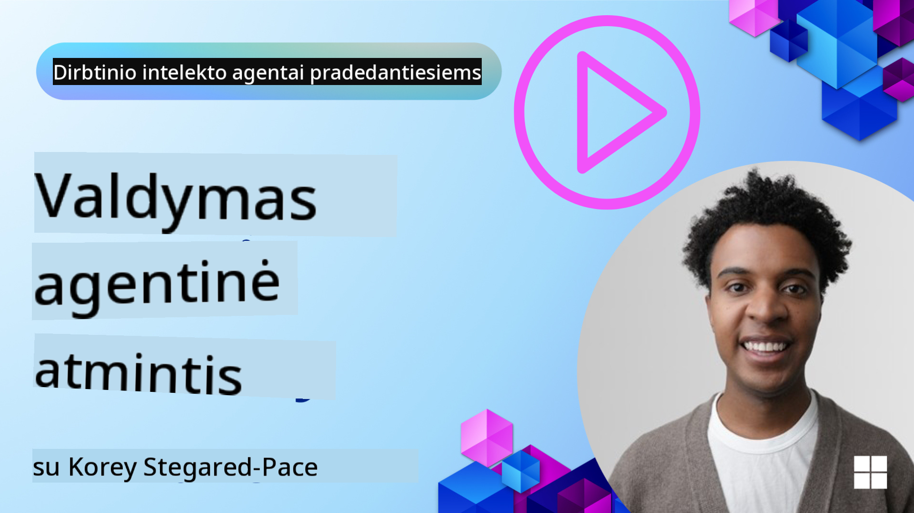

<!--
CO_OP_TRANSLATOR_METADATA:
{
  "original_hash": "d2c9703548140bafa2d6a77406552542",
  "translation_date": "2025-10-03T15:15:49+00:00",
  "source_file": "13-agent-memory/README.md",
  "language_code": "lt"
}
-->
# Atmintis AI agentams 

Kalbant apie unikalius AI agentų kūrimo privalumus, dažniausiai aptariami du dalykai: gebėjimas naudoti įrankius užduotims atlikti ir gebėjimas tobulėti laikui bėgant. Atmintis yra pagrindas kuriant savarankiškai tobulėjančius agentus, kurie gali suteikti geresnę patirtį mūsų vartotojams.

Šioje pamokoje aptarsime, kas yra atmintis AI agentams, kaip ją valdyti ir panaudoti mūsų programų naudai.

## Įvadas

Šioje pamokoje aptarsime:

• **AI agentų atminties supratimą**: Kas yra atmintis ir kodėl ji būtina agentams.

• **Atminties įgyvendinimą ir saugojimą**: Praktiniai metodai, kaip pridėti atminties funkcijas AI agentams, akcentuojant trumpalaikę ir ilgalaikę atmintį.

• **AI agentų savarankiško tobulėjimo užtikrinimą**: Kaip atmintis leidžia agentams mokytis iš ankstesnių sąveikų ir tobulėti laikui bėgant.

## Mokymosi tikslai

Baigę šią pamoką, sužinosite, kaip:

• **Atskirti įvairius AI agentų atminties tipus**, įskaitant darbinę, trumpalaikę ir ilgalaikę atmintį, taip pat specializuotas formas, tokias kaip asmenybės ir epizodinė atmintis.

• **Įgyvendinti ir valdyti trumpalaikę ir ilgalaikę atmintį AI agentams**, naudojant Semantic Kernel sistemą, pasitelkiant įrankius, tokius kaip Mem0 ir Whiteboard atmintis, bei integruojant su Azure AI Search.

• **Suprasti savarankiškai tobulėjančių AI agentų principus** ir kaip tvirtos atminties valdymo sistemos prisideda prie nuolatinio mokymosi ir prisitaikymo.

## AI agentų atminties supratimas

Iš esmės, **AI agentų atmintis reiškia mechanizmus, leidžiančius jiems išsaugoti ir prisiminti informaciją**. Ši informacija gali būti specifinės detalės apie pokalbį, vartotojo pageidavimus, ankstesnius veiksmus ar net išmoktas tendencijas.

Be atminties AI programos dažnai yra be būsenos, tai reiškia, kad kiekviena sąveika prasideda nuo nulio. Tai sukelia pasikartojančią ir varginančią vartotojo patirtį, kai agentas „pamiršta“ ankstesnį kontekstą ar pageidavimus.

### Kodėl atmintis svarbi?

Agentų intelektas yra glaudžiai susijęs su jų gebėjimu prisiminti ir panaudoti ankstesnę informaciją. Atmintis leidžia agentams būti:

• **Refleksyviems**: Mokytis iš ankstesnių veiksmų ir rezultatų.

• **Interaktyviems**: Išlaikyti kontekstą per vykstantį pokalbį.

• **Proaktyviems ir reaktyviems**: Nuspėti poreikius arba tinkamai reaguoti remiantis istorine informacija.

• **Autonomiškiems**: Veikti savarankiškiau, remiantis išsaugotomis žiniomis.

Atminties įgyvendinimo tikslas yra padaryti agentus **patikimesnius ir pajėgesnius**.

### Atminties tipai

#### Darbinė atmintis

Tai tarsi užrašų lapelis, kurį agentas naudoja vykdydamas vieną užduotį ar minties procesą. Ji saugo tiesioginę informaciją, reikalingą kitam žingsniui atlikti.

AI agentams darbinė atmintis dažnai fiksuoja svarbiausią informaciją iš pokalbio, net jei visas pokalbio istorija yra ilga ar sutrumpinta. Ji koncentruojasi į pagrindinių elementų, tokių kaip reikalavimai, pasiūlymai, sprendimai ir veiksmai, išskyrimą.

**Darbinės atminties pavyzdys**

Kelionių rezervavimo agentas darbinėje atmintyje gali išsaugoti vartotojo dabartinį prašymą, pavyzdžiui, „Noriu užsisakyti kelionę į Paryžių“. Šis konkretus reikalavimas laikomas agento tiesioginiame kontekste, kad būtų galima vadovauti dabartinei sąveikai.

#### Trumpalaikė atmintis

Šis atminties tipas saugo informaciją vieno pokalbio ar sesijos metu. Tai yra dabartinio pokalbio kontekstas, leidžiantis agentui grįžti prie ankstesnių dialogo posūkių.

**Trumpalaikės atminties pavyzdys**

Jei vartotojas klausia: „Kiek kainuotų skrydis į Paryžių?“ ir vėliau priduria: „O kaip dėl apgyvendinimo ten?“, trumpalaikė atmintis užtikrina, kad agentas žinotų, jog „ten“ reiškia „Paryžių“ tame pačiame pokalbyje.

#### Ilgalaikė atmintis

Tai informacija, kuri išlieka per kelis pokalbius ar sesijas. Ji leidžia agentams prisiminti vartotojo pageidavimus, istorines sąveikas ar bendras žinias ilgesnį laiką. Tai svarbu personalizacijai.

**Ilgalaikės atminties pavyzdys**

Ilgalaikė atmintis gali saugoti, kad „Benui patinka slidinėjimas ir lauko veiklos, mėgsta kavą su kalnų vaizdu ir nori vengti sudėtingų slidinėjimo trasų dėl ankstesnės traumos“. Ši informacija, išmokta iš ankstesnių sąveikų, daro rekomendacijas būsimuose kelionių planavimo sesijose labai personalizuotas.

#### Asmenybės atmintis

Šis specializuotas atminties tipas padeda agentui sukurti nuoseklią „asmenybę“ ar „vaidmenį“. Tai leidžia agentui prisiminti detales apie save ar savo numatytą vaidmenį, todėl sąveika tampa sklandesnė ir labiau orientuota.

**Asmenybės atminties pavyzdys**

Jei kelionių agentas yra sukurtas kaip „ekspertas slidinėjimo planuotojas“, asmenybės atmintis gali sustiprinti šį vaidmenį, paveikdama jo atsakymus, kad jie atitiktų eksperto toną ir žinias.

#### Darbo eiga/Epizodinė atmintis

Ši atmintis saugo veiksmų seką, kurią agentas atlieka vykdydamas sudėtingą užduotį, įskaitant sėkmes ir nesėkmes. Tai tarsi prisiminimas apie konkrečius „epizodus“ ar ankstesnes patirtis, kad iš jų būtų galima mokytis.

**Epizodinės atminties pavyzdys**

Jei agentas bandė užsisakyti konkretų skrydį, bet nepavyko dėl vietų trūkumo, epizodinė atmintis galėtų užfiksuoti šią nesėkmę, leidžiant agentui bandyti alternatyvius skrydžius arba informuoti vartotoją apie problemą labiau informuotu būdu per kitą bandymą.

#### Subjekto atmintis

Tai apima specifinių subjektų (pvz., žmonių, vietų ar daiktų) ir įvykių iš pokalbių išskyrimą ir prisiminimą. Tai leidžia agentui sukurti struktūrinį supratimą apie pagrindinius aptartus elementus.

**Subjekto atminties pavyzdys**

Iš pokalbio apie ankstesnę kelionę agentas galėtų išskirti „Paryžių“, „Eifelio bokštą“ ir „vakarienę restorane Le Chat Noir“. Per būsimą sąveiką agentas galėtų prisiminti „Le Chat Noir“ ir pasiūlyti ten rezervuoti naują vakarienę.

#### Struktūrizuotas RAG (Retrieval Augmented Generation)

Nors RAG yra platesnė technika, „Struktūrizuotas RAG“ išskiriamas kaip galinga atminties technologija. Jis ištraukia tankią, struktūrizuotą informaciją iš įvairių šaltinių (pokalbių, el. laiškų, vaizdų) ir naudoja ją tikslumui, prisiminimui ir atsakymų greičiui pagerinti. Skirtingai nuo klasikinio RAG, kuris remiasi tik semantiniu panašumu, Struktūrizuotas RAG dirba su informacijos struktūra.

**Struktūrizuoto RAG pavyzdys**

Užuot tiesiog atitikęs raktinius žodžius, Struktūrizuotas RAG galėtų analizuoti skrydžio detales (kelionės tikslą, datą, laiką, oro linijas) iš el. laiško ir saugoti jas struktūrizuotu būdu. Tai leidžia tiksliai užklausti, pavyzdžiui, „Kokį skrydį užsisakiau į Paryžių antradienį?“

## Atminties įgyvendinimas ir saugojimas

AI agentų atminties įgyvendinimas apima sistemingą **atminties valdymo** procesą, kuris apima informacijos generavimą, saugojimą, išgavimą, integravimą, atnaujinimą ir net „pamiršimą“ (arba ištrynimą). Informacijos išgavimas yra ypač svarbus aspektas.

### Specializuoti atminties įrankiai

Vienas iš būdų saugoti ir valdyti agentų atmintį yra naudoti specializuotus įrankius, tokius kaip Mem0. Mem0 veikia kaip nuolatinis atminties sluoksnis, leidžiantis agentams prisiminti svarbias sąveikas, saugoti vartotojo pageidavimus ir faktinį kontekstą bei mokytis iš sėkmių ir nesėkmių laikui bėgant. Idėja yra ta, kad agentai be būsenos tampa būseniniais.

Jis veikia per **dviejų etapų atminties procesą: išgavimą ir atnaujinimą**. Pirma, pranešimai, pridėti prie agento gijos, siunčiami į Mem0 paslaugą, kuri naudoja didelio masto kalbos modelį (LLM), kad apibendrintų pokalbio istoriją ir išgautų naujus prisiminimus. Vėliau LLM valdomas atnaujinimo etapas nustato, ar pridėti, modifikuoti ar ištrinti šiuos prisiminimus, saugodamas juos hibridiniame duomenų saugykloje, kuri gali apimti vektorių, grafų ir raktų-reikšmių duomenų bazes. Ši sistema taip pat palaiko įvairius atminties tipus ir gali įtraukti grafų atmintį, skirtą valdyti ryšius tarp subjektų.

### Atminties saugojimas naudojant RAG

Be specializuotų atminties įrankių, tokių kaip Mem0, galite pasinaudoti patikimomis paieškos paslaugomis, tokiomis kaip **Azure AI Search**, kaip pagrindu atminties saugojimui ir išgavimui, ypač struktūrizuotam RAG.

Tai leidžia pagrįsti agento atsakymus savo duomenimis, užtikrinant aktualesnius ir tikslesnius atsakymus. Azure AI Search gali būti naudojamas vartotojo specifinių kelionių prisiminimų, produktų katalogų ar bet kokių kitų specifinių žinių saugojimui.

Azure AI Search palaiko tokias funkcijas kaip **Struktūrizuotas RAG**, kuris puikiai ištraukia ir išgauna tankią, struktūrizuotą informaciją iš didelių duomenų rinkinių, tokių kaip pokalbių istorijos, el. laiškai ar net vaizdai. Tai suteikia „antžmogišką tikslumą ir prisiminimą“, palyginti su tradiciniais teksto skaidymo ir įterpimo metodais.

## AI agentų savarankiško tobulėjimo užtikrinimas

Dažnas savarankiškai tobulėjančių agentų modelis apima **„žinių agento“** įvedimą. Šis atskiras agentas stebi pagrindinį pokalbį tarp vartotojo ir pagrindinio agento. Jo vaidmuo yra:

1. **Nustatyti vertingą informaciją**: Nustatyti, ar kuri nors pokalbio dalis verta išsaugoti kaip bendras žinias ar specifinį vartotojo pageidavimą.

2. **Išgauti ir apibendrinti**: Išskirti esminę mokymosi ar pageidavimų informaciją iš pokalbio.

3. **Saugojimas žinių bazėje**: Išgautą informaciją išsaugoti, dažnai vektorinėje duomenų bazėje, kad ją būtų galima vėliau išgauti.

4. **Papildyti būsimus užklausimus**: Kai vartotojas inicijuoja naują užklausą, žinių agentas išgauna atitinkamą išsaugotą informaciją ir prideda ją prie vartotojo užklausos, suteikdamas pagrindiniam agentui svarbų kontekstą (panašiai kaip RAG).

### Atminties optimizavimas

• **Vėlavimo valdymas**: Siekiant išvengti vartotojo sąveikos sulėtėjimo, iš pradžių galima naudoti pigesnį, greitesnį modelį, kad greitai patikrintų, ar informacija verta saugojimo ar išgavimo, sudėtingesnį išgavimo/saugojimo procesą įjungiant tik prireikus.

• **Žinių bazės priežiūra**: Augančiai žinių bazei rečiau naudojama informacija gali būti perkelta į „šaltą saugyklą“, kad būtų valdomos išlaidos.

## Turite daugiau klausimų apie agentų atmintį?

Prisijunkite prie [Azure AI Foundry Discord](https://aka.ms/ai-agents/discord), kad susitiktumėte su kitais besimokančiais, dalyvautumėte konsultacijose ir gautumėte atsakymus į savo klausimus apie AI agentus.

---

**Atsakomybės apribojimas**:  
Šis dokumentas buvo išverstas naudojant dirbtinio intelekto vertimo paslaugą [Co-op Translator](https://github.com/Azure/co-op-translator). Nors siekiame tikslumo, atkreipkite dėmesį, kad automatiniai vertimai gali turėti klaidų ar netikslumų. Originalus dokumentas jo gimtąja kalba turėtų būti laikomas autoritetingu šaltiniu. Dėl svarbios informacijos rekomenduojama profesionali žmogaus vertimo paslauga. Mes neprisiimame atsakomybės už nesusipratimus ar klaidingus aiškinimus, kylančius dėl šio vertimo naudojimo.