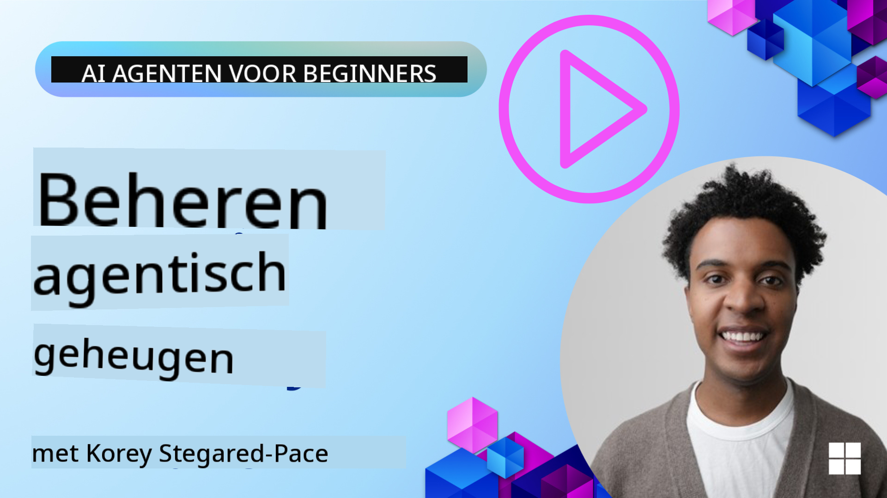

<!--
CO_OP_TRANSLATOR_METADATA:
{
  "original_hash": "d2c9703548140bafa2d6a77406552542",
  "translation_date": "2025-10-03T14:50:12+00:00",
  "source_file": "13-agent-memory/README.md",
  "language_code": "nl"
}
-->
# Geheugen voor AI-agenten

Bij het bespreken van de unieke voordelen van het creëren van AI-agenten worden vooral twee dingen besproken: de mogelijkheid om tools te gebruiken om taken uit te voeren en de mogelijkheid om in de loop van de tijd te verbeteren. Geheugen vormt de basis voor het creëren van zelfverbeterende agenten die betere ervaringen kunnen bieden aan onze gebruikers.

In deze les bekijken we wat geheugen betekent voor AI-agenten en hoe we het kunnen beheren en gebruiken voor het voordeel van onze applicaties.

## Introductie

Deze les behandelt:

• **Begrijpen van AI-agentgeheugen**: Wat geheugen is en waarom het essentieel is voor agenten.

• **Implementeren en opslaan van geheugen**: Praktische methoden om geheugenfunctionaliteit toe te voegen aan je AI-agenten, met focus op kortetermijn- en langetermijngeheugen.

• **AI-agenten zelfverbeterend maken**: Hoe geheugen agenten in staat stelt te leren van eerdere interacties en in de loop van de tijd te verbeteren.

## Leerdoelen

Na het voltooien van deze les weet je hoe je:

• **Verschillende soorten AI-agentgeheugen kunt onderscheiden**, waaronder werkgeheugen, kortetermijn- en langetermijngeheugen, evenals gespecialiseerde vormen zoals persona- en episodisch geheugen.

• **Kortetermijn- en langetermijngeheugen kunt implementeren en beheren voor AI-agenten** met behulp van het Semantic Kernel-framework, tools zoals Mem0 en Whiteboard-geheugen, en integratie met Azure AI Search.

• **De principes achter zelfverbeterende AI-agenten kunt begrijpen** en hoe robuuste geheugenbeheersystemen bijdragen aan continu leren en aanpassen.

## Begrijpen van AI-agentgeheugen

In essentie verwijst **geheugen voor AI-agenten naar de mechanismen die hen in staat stellen informatie te behouden en op te roepen**. Deze informatie kan specifieke details over een gesprek, gebruikersvoorkeuren, eerdere acties of zelfs geleerde patronen omvatten.

Zonder geheugen zijn AI-applicaties vaak stateless, wat betekent dat elke interactie opnieuw begint. Dit leidt tot een repetitieve en frustrerende gebruikerservaring waarbij de agent eerdere context of voorkeuren "vergeet".

### Waarom is geheugen belangrijk?

De intelligentie van een agent is nauw verbonden met zijn vermogen om eerdere informatie te onthouden en te gebruiken. Geheugen stelt agenten in staat om:

• **Reflectief** te zijn: Leren van eerdere acties en resultaten.

• **Interactief** te zijn: Context behouden tijdens een lopend gesprek.

• **Proactief en reactief** te zijn: Behoeften anticiperen of passend reageren op basis van historische gegevens.

• **Autonoom** te zijn: Meer zelfstandig opereren door gebruik te maken van opgeslagen kennis.

Het doel van het implementeren van geheugen is om agenten meer **betrouwbaar en capabel** te maken.

### Soorten geheugen

#### Werkgeheugen

Zie dit als een stuk kladpapier dat een agent gebruikt tijdens een enkele, lopende taak of denkproces. Het bevat directe informatie die nodig is om de volgende stap te berekenen.

Voor AI-agenten vangt werkgeheugen vaak de meest relevante informatie uit een gesprek op, zelfs als de volledige chatgeschiedenis lang of ingekort is. Het richt zich op het extraheren van belangrijke elementen zoals vereisten, voorstellen, beslissingen en acties.

**Voorbeeld van werkgeheugen**

Bij een reisboekingsagent kan werkgeheugen de huidige aanvraag van de gebruiker vastleggen, zoals "Ik wil een reis naar Parijs boeken". Deze specifieke vereiste wordt in de directe context van de agent gehouden om de huidige interactie te sturen.

#### Kortetermijngeheugen

Dit type geheugen behoudt informatie gedurende de duur van een enkel gesprek of sessie. Het is de context van het huidige gesprek, waardoor de agent kan verwijzen naar eerdere wendingen in de dialoog.

**Voorbeeld van kortetermijngeheugen**

Als een gebruiker vraagt: "Hoeveel kost een vlucht naar Parijs?" en vervolgens vervolgt met "Hoe zit het met accommodatie daar?", zorgt kortetermijngeheugen ervoor dat de agent weet dat "daar" verwijst naar "Parijs" binnen hetzelfde gesprek.

#### Langetermijngeheugen

Dit is informatie die blijft bestaan over meerdere gesprekken of sessies. Het stelt agenten in staat gebruikersvoorkeuren, historische interacties of algemene kennis over langere perioden te onthouden. Dit is belangrijk voor personalisatie.

**Voorbeeld van langetermijngeheugen**

Langetermijngeheugen kan opslaan dat "Ben houdt van skiën en buitenactiviteiten, drinkt graag koffie met uitzicht op de bergen en wil geavanceerde skipistes vermijden vanwege een eerdere blessure". Deze informatie, geleerd uit eerdere interacties, beïnvloedt aanbevelingen in toekomstige reisplanningssessies, waardoor ze sterk gepersonaliseerd worden.

#### Persona-geheugen

Dit gespecialiseerde type geheugen helpt een agent een consistente "persoonlijkheid" of "persona" te ontwikkelen. Het stelt de agent in staat details over zichzelf of zijn beoogde rol te onthouden, waardoor interacties vloeiender en gerichter worden.

**Voorbeeld van persona-geheugen**

Als de reisagent is ontworpen als een "expert in ski-planning", kan persona-geheugen deze rol versterken, waardoor de antwoorden van de agent worden afgestemd op de toon en kennis van een expert.

#### Workflow/Episodisch geheugen

Dit geheugen slaat de reeks stappen op die een agent neemt tijdens een complexe taak, inclusief successen en mislukkingen. Het is alsof specifieke "episodes" of eerdere ervaringen worden onthouden om ervan te leren.

**Voorbeeld van episodisch geheugen**

Als de agent probeerde een specifieke vlucht te boeken, maar dit mislukte vanwege onbeschikbaarheid, kan episodisch geheugen deze mislukking registreren, zodat de agent alternatieve vluchten kan proberen of de gebruiker op een meer geïnformeerde manier kan informeren tijdens een volgende poging.

#### Entiteit-geheugen

Dit omvat het extraheren en onthouden van specifieke entiteiten (zoals mensen, plaatsen of dingen) en gebeurtenissen uit gesprekken. Het stelt de agent in staat een gestructureerd begrip op te bouwen van belangrijke elementen die worden besproken.

**Voorbeeld van entiteit-geheugen**

Uit een gesprek over een eerdere reis kan de agent "Parijs", "Eiffeltoren" en "diner bij Le Chat Noir restaurant" als entiteiten extraheren. In een toekomstige interactie kan de agent "Le Chat Noir" onthouden en aanbieden om daar een nieuwe reservering te maken.

#### Gestructureerde RAG (Retrieval Augmented Generation)

Hoewel RAG een bredere techniek is, wordt "Gestructureerde RAG" benadrukt als een krachtige geheugentechnologie. Het haalt dense, gestructureerde informatie uit verschillende bronnen (gesprekken, e-mails, afbeeldingen) en gebruikt deze om precisie, recall en snelheid in antwoorden te verbeteren. In tegenstelling tot klassieke RAG, die uitsluitend vertrouwt op semantische overeenkomsten, werkt Gestructureerde RAG met de inherente structuur van informatie.

**Voorbeeld van gestructureerde RAG**

In plaats van alleen trefwoorden te matchen, kan Gestructureerde RAG vluchtgegevens (bestemming, datum, tijd, luchtvaartmaatschappij) uit een e-mail halen en deze op een gestructureerde manier opslaan. Dit maakt nauwkeurige vragen mogelijk, zoals "Welke vlucht heb ik geboekt naar Parijs op dinsdag?"

## Implementeren en opslaan van geheugen

Het implementeren van geheugen voor AI-agenten omvat een systematisch proces van **geheugenbeheer**, waaronder het genereren, opslaan, ophalen, integreren, bijwerken en zelfs "vergeten" (of verwijderen) van informatie. Het ophalen is een bijzonder cruciaal aspect.

### Gespecialiseerde geheugentools

Een manier om agentgeheugen op te slaan en te beheren is door gebruik te maken van gespecialiseerde tools zoals Mem0. Mem0 werkt als een persistente geheugenslaag, waardoor agenten relevante interacties kunnen onthouden, gebruikersvoorkeuren en feitelijke context kunnen opslaan, en kunnen leren van successen en mislukkingen in de loop van de tijd. Het idee hier is dat stateless agenten veranderen in stateful agenten.

Het werkt via een **twee-fasen geheugenpijplijn: extractie en update**. Eerst worden berichten die aan de thread van een agent worden toegevoegd naar de Mem0-service gestuurd, die een Large Language Model (LLM) gebruikt om gespreksgeschiedenis samen te vatten en nieuwe herinneringen te extraheren. Vervolgens bepaalt een LLM-gestuurde updatefase of deze herinneringen moeten worden toegevoegd, gewijzigd of verwijderd, en worden ze opgeslagen in een hybride datastore die vector-, graf- en key-value-databases kan omvatten. Dit systeem ondersteunt ook verschillende geheugentypen en kan grafgeheugen opnemen voor het beheren van relaties tussen entiteiten.

### Geheugen opslaan met RAG

Naast gespecialiseerde geheugentools zoals Mem0 kun je robuuste zoekservices zoals **Azure AI Search gebruiken als backend voor het opslaan en ophalen van herinneringen**, vooral voor gestructureerde RAG.

Dit stelt je in staat om de antwoorden van je agent te baseren op je eigen gegevens, wat zorgt voor relevantere en nauwkeurigere antwoorden. Azure AI Search kan worden gebruikt om gebruikersspecifieke reisherinneringen, productcatalogi of andere domeinspecifieke kennis op te slaan.

Azure AI Search ondersteunt mogelijkheden zoals **Gestructureerde RAG**, die uitblinkt in het extraheren en ophalen van dense, gestructureerde informatie uit grote datasets zoals gespreksgeschiedenissen, e-mails of zelfs afbeeldingen. Dit biedt "supermenselijke precisie en recall" vergeleken met traditionele tekstchunking- en embeddingbenaderingen.

## AI-agenten zelfverbeterend maken

Een veelvoorkomend patroon voor zelfverbeterende agenten is het introduceren van een **"kennisagent"**. Deze aparte agent observeert het hoofdgesprek tussen de gebruiker en de primaire agent. Zijn rol is om:

1. **Waardevolle informatie te identificeren**: Bepalen of een deel van het gesprek de moeite waard is om op te slaan als algemene kennis of een specifieke gebruikersvoorkeur.

2. **Extractie en samenvatting**: De essentiële les of voorkeur uit het gesprek destilleren.

3. **Opslaan in een kennisbank**: Deze geëxtraheerde informatie bewaren, vaak in een vectordatabase, zodat deze later kan worden opgehaald.

4. **Toekomstige vragen aanvullen**: Wanneer de gebruiker een nieuwe vraag stelt, haalt de kennisagent relevante opgeslagen informatie op en voegt deze toe aan de prompt van de gebruiker, waardoor cruciale context wordt geboden aan de primaire agent (vergelijkbaar met RAG).

### Optimalisaties voor geheugen

• **Latentiebeheer**: Om vertragingen in gebruikersinteracties te voorkomen, kan aanvankelijk een goedkoper, sneller model worden gebruikt om snel te controleren of informatie waardevol is om op te slaan of op te halen, waarbij alleen het complexere extractie-/ophaalproces wordt ingeschakeld wanneer nodig.

• **Onderhoud van de kennisbank**: Voor een groeiende kennisbank kan minder vaak gebruikte informatie naar "koude opslag" worden verplaatst om kosten te beheren.

## Meer vragen over agentgeheugen?

Word lid van de [Azure AI Foundry Discord](https://aka.ms/ai-agents/discord) om andere leerlingen te ontmoeten, kantooruren bij te wonen en je vragen over AI-agenten beantwoord te krijgen.

---

**Disclaimer**:  
Dit document is vertaald met behulp van de AI-vertalingsservice [Co-op Translator](https://github.com/Azure/co-op-translator). Hoewel we streven naar nauwkeurigheid, dient u zich ervan bewust te zijn dat geautomatiseerde vertalingen fouten of onnauwkeurigheden kunnen bevatten. Het originele document in de oorspronkelijke taal moet worden beschouwd als de gezaghebbende bron. Voor cruciale informatie wordt professionele menselijke vertaling aanbevolen. Wij zijn niet aansprakelijk voor misverstanden of verkeerde interpretaties die voortvloeien uit het gebruik van deze vertaling.