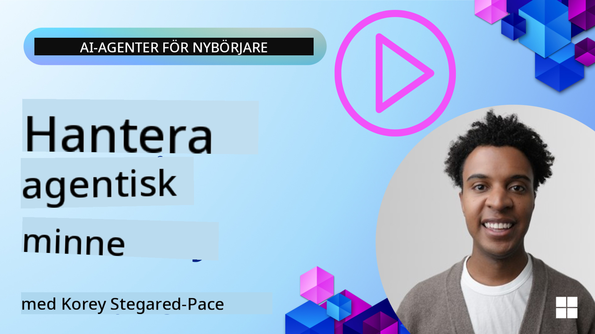

<!--
CO_OP_TRANSLATOR_METADATA:
{
  "original_hash": "c27e2a2e9055910545560e8472b341d8",
  "translation_date": "2025-10-02T15:33:51+00:00",
  "source_file": "13-agent-memory/README.md",
  "language_code": "sv"
}
-->
# Minneshantering för AI-agenter

När man diskuterar de unika fördelarna med att skapa AI-agenter, nämns främst två saker: förmågan att använda verktyg för att utföra uppgifter och förmågan att förbättras över tid. Minnet är grunden för att skapa självförbättrande agenter som kan ge bättre upplevelser för våra användare.

I denna lektion kommer vi att titta på vad minne innebär för AI-agenter och hur vi kan hantera och använda det för att förbättra våra applikationer.

## Introduktion

Denna lektion kommer att täcka:

• **Förstå AI-agenters minne**: Vad minne är och varför det är viktigt för agenter.

• **Implementera och lagra minne**: Praktiska metoder för att lägga till minnesfunktioner i dina AI-agenter, med fokus på kortsiktigt och långsiktigt minne.

• **Göra AI-agenter självförbättrande**: Hur minne gör det möjligt för agenter att lära sig av tidigare interaktioner och förbättras över tid.

## Lärandemål

Efter att ha genomfört denna lektion kommer du att kunna:

• **Skilja mellan olika typer av AI-agenters minne**, inklusive arbetsminne, kortsiktigt och långsiktigt minne, samt specialiserade former som personaminne och episodiskt minne.

• **Implementera och hantera kortsiktigt och långsiktigt minne för AI-agenter** med hjälp av Semantic Kernel-ramverket, verktyg som Mem0 och Whiteboard-minne, samt integrering med Azure AI Search.

• **Förstå principerna bakom självförbättrande AI-agenter** och hur robusta minneshanteringssystem bidrar till kontinuerligt lärande och anpassning.

## Förstå AI-agenters minne

I grunden innebär **minne för AI-agenter mekanismer som gör det möjligt för dem att behålla och återkalla information**. Denna information kan vara specifika detaljer om en konversation, användarpreferenser, tidigare handlingar eller till och med inlärda mönster.

Utan minne är AI-applikationer ofta tillståndslösa, vilket innebär att varje interaktion börjar från början. Detta leder till en repetitiv och frustrerande användarupplevelse där agenten "glömmer" tidigare sammanhang eller preferenser.

### Varför är minne viktigt?

En agents intelligens är starkt kopplad till dess förmåga att återkalla och använda tidigare information. Minnet gör det möjligt för agenter att vara:

• **Reflekterande**: Lära sig av tidigare handlingar och resultat.

• **Interaktiva**: Bibehålla sammanhang under en pågående konversation.

• **Proaktiva och reaktiva**: Förutse behov eller svara lämpligt baserat på historiska data.

• **Självständiga**: Arbeta mer oberoende genom att dra nytta av lagrad kunskap.

Målet med att implementera minne är att göra agenter mer **pålitliga och kapabla**.

### Typer av minne

#### Arbetsminne

Tänk på detta som en bit kladdpapper som en agent använder under en enda, pågående uppgift eller tankeprocess. Det håller omedelbar information som behövs för att beräkna nästa steg.

För AI-agenter fångar arbetsminnet ofta den mest relevanta informationen från en konversation, även om hela chattens historik är lång eller förkortad. Det fokuserar på att extrahera nyckelelement som krav, förslag, beslut och handlingar.

**Exempel på arbetsminne**

I en resebokningsagent kan arbetsminnet fånga användarens aktuella begäran, som "Jag vill boka en resa till Paris". Detta specifika krav hålls i agentens omedelbara sammanhang för att styra den aktuella interaktionen.

#### Kortsiktigt minne

Denna typ av minne behåller information under en enda konversation eller session. Det är sammanhanget för den aktuella chatten, vilket gör att agenten kan referera tillbaka till tidigare turer i dialogen.

**Exempel på kortsiktigt minne**

Om en användare frågar, "Hur mycket kostar en flygresa till Paris?" och sedan följer upp med "Hur är det med boende där?", säkerställer kortsiktigt minne att agenten vet att "där" syftar på "Paris" inom samma konversation.

#### Långsiktigt minne

Detta är information som kvarstår över flera konversationer eller sessioner. Det gör det möjligt för agenter att komma ihåg användarpreferenser, historiska interaktioner eller generell kunskap över längre perioder. Detta är viktigt för personalisering.

**Exempel på långsiktigt minne**

Ett långsiktigt minne kan lagra att "Ben gillar skidåkning och utomhusaktiviteter, föredrar kaffe med bergsutsikt och vill undvika avancerade skidbackar på grund av en tidigare skada". Denna information, inlärd från tidigare interaktioner, påverkar rekommendationer i framtida reseplaneringssessioner och gör dem mycket personliga.

#### Personaminne

Denna specialiserade typ av minne hjälper en agent att utveckla en konsekvent "personlighet" eller "persona". Det gör att agenten kan komma ihåg detaljer om sig själv eller sin avsedda roll, vilket gör interaktioner mer flytande och fokuserade.

**Exempel på personaminne**

Om reseagenten är designad att vara en "expert på skidplanering", kan personaminne förstärka denna roll och påverka dess svar så att de överensstämmer med en experts ton och kunskap.

#### Arbetsflöde/Episodiskt minne

Detta minne lagrar sekvensen av steg en agent tar under en komplex uppgift, inklusive framgångar och misslyckanden. Det är som att komma ihåg specifika "episoder" eller tidigare erfarenheter för att lära sig av dem.

**Exempel på episodiskt minne**

Om agenten försökte boka ett specifikt flyg men misslyckades på grund av otillgänglighet, kan episodiskt minne registrera detta misslyckande, vilket gör att agenten kan försöka alternativa flyg eller informera användaren om problemet på ett mer informerat sätt vid ett senare försök.

#### Entitetsminne

Detta innebär att extrahera och komma ihåg specifika entiteter (som personer, platser eller saker) och händelser från konversationer. Det gör att agenten kan bygga en strukturerad förståelse av nyckelelement som diskuteras.

**Exempel på entitetsminne**

Från en konversation om en tidigare resa kan agenten extrahera "Paris", "Eiffeltornet" och "middag på restaurang Le Chat Noir" som entiteter. Vid en framtida interaktion kan agenten komma ihåg "Le Chat Noir" och erbjuda att boka en ny reservation där.

#### Strukturerad RAG (Retrieval Augmented Generation)

Även om RAG är en bredare teknik, lyfts "Strukturerad RAG" fram som en kraftfull minnesteknologi. Den extraherar tät, strukturerad information från olika källor (konversationer, e-post, bilder) och använder den för att förbättra precision, återkallning och hastighet i svar. Till skillnad från klassisk RAG som enbart förlitar sig på semantisk likhet, arbetar Strukturerad RAG med informationens inneboende struktur.

**Exempel på Strukturerad RAG**

Istället för att bara matcha nyckelord kan Strukturerad RAG analysera flyguppgifter (destination, datum, tid, flygbolag) från ett e-postmeddelande och lagra dem på ett strukturerat sätt. Detta möjliggör precisa frågor som "Vilket flyg bokade jag till Paris på tisdag?"

## Implementera och lagra minne

Att implementera minne för AI-agenter innebär en systematisk process av **minneshantering**, som inkluderar att generera, lagra, hämta, integrera, uppdatera och till och med "glömma" (eller radera) information. Hämtning är en särskilt viktig aspekt.

### Specialiserade minnesverktyg

Ett sätt att lagra och hantera agentminne är att använda specialiserade verktyg som Mem0. Mem0 fungerar som ett beständigt minneslager, vilket gör att agenter kan återkalla relevanta interaktioner, lagra användarpreferenser och faktuell kontext, samt lära sig av framgångar och misslyckanden över tid. Idén här är att tillståndslösa agenter blir tillståndsfulla.

Det fungerar genom en **tvåfasig minnespipeline: extraktion och uppdatering**. Först skickas meddelanden som läggs till en agents tråd till Mem0-tjänsten, som använder en Large Language Model (LLM) för att sammanfatta konversationshistorik och extrahera nya minnen. Därefter avgör en LLM-driven uppdateringsfas om dessa minnen ska läggas till, modifieras eller raderas, och lagrar dem i en hybrid datalagring som kan inkludera vektor-, graf- och nyckel-värde-databaser. Detta system stöder också olika minnestyper och kan integrera grafminne för att hantera relationer mellan entiteter.

### Lagra minne med RAG

Utöver specialiserade minnesverktyg som Mem0 kan du använda robusta söktjänster som **Azure AI Search som backend för att lagra och hämta minnen**, särskilt för strukturerad RAG.

Detta gör det möjligt att grunda agentens svar med din egen data, vilket säkerställer mer relevanta och korrekta svar. Azure AI Search kan användas för att lagra användarspecifika reseminnen, produktkataloger eller annan domänspecifik kunskap.

Azure AI Search stöder funktioner som **Strukturerad RAG**, som utmärker sig vid att extrahera och hämta tät, strukturerad information från stora dataset som konversationshistorik, e-post eller till och med bilder. Detta ger "övermänsklig precision och återkallning" jämfört med traditionella textchunking- och inbäddningsmetoder.

## Göra AI-agenter självförbättrande

Ett vanligt mönster för självförbättrande agenter innebär att introducera en **"kunskapsagent"**. Denna separata agent observerar huvudkonversationen mellan användaren och den primära agenten. Dess roll är att:

1. **Identifiera värdefull information**: Avgöra om någon del av konversationen är värd att spara som generell kunskap eller en specifik användarpreferens.

2. **Extrahera och sammanfatta**: Destillera den väsentliga lärdomen eller preferensen från konversationen.

3. **Lagra i en kunskapsbas**: Bevara denna extraherade information, ofta i en vektordatabas, så att den kan hämtas senare.

4. **Förbättra framtida frågor**: När användaren initierar en ny fråga hämtar kunskapsagenten relevant lagrad information och lägger till den i användarens prompt, vilket ger viktig kontext till den primära agenten (liknande RAG).

### Optimeringar för minne

• **Latenshantering**: För att undvika att sakta ner användarinteraktioner kan en billigare, snabbare modell användas initialt för att snabbt kontrollera om information är värd att lagra eller hämta, och endast använda den mer komplexa extraktions-/hämtprocessen vid behov.

• **Underhåll av kunskapsbas**: För en växande kunskapsbas kan mindre frekvent använd information flyttas till "kall lagring" för att hantera kostnader.

## Har du fler frågor om agentminne?

Gå med i [Azure AI Foundry Discord](https://aka.ms/ai-agents/discord) för att träffa andra elever, delta i öppet hus och få svar på dina frågor om AI-agenter.

---

**Ansvarsfriskrivning**:  
Detta dokument har översatts med hjälp av AI-översättningstjänsten [Co-op Translator](https://github.com/Azure/co-op-translator). Även om vi strävar efter noggrannhet, bör det noteras att automatiserade översättningar kan innehålla fel eller felaktigheter. Det ursprungliga dokumentet på dess originalspråk bör betraktas som den auktoritativa källan. För kritisk information rekommenderas professionell mänsklig översättning. Vi ansvarar inte för eventuella missförstånd eller feltolkningar som uppstår vid användning av denna översättning.