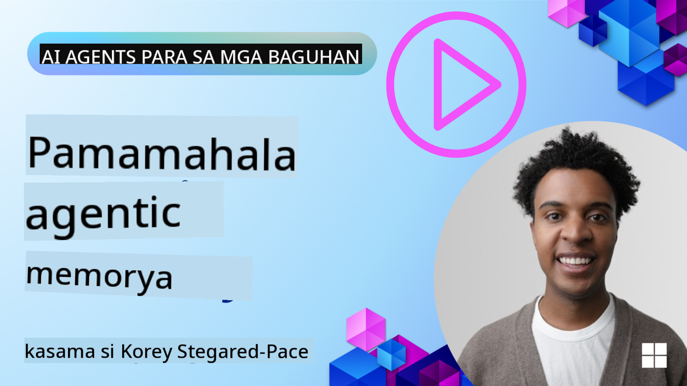

<!--
CO_OP_TRANSLATOR_METADATA:
{
  "original_hash": "c27e2a2e9055910545560e8472b341d8",
  "translation_date": "2025-10-02T11:01:28+00:00",
  "source_file": "13-agent-memory/README.md",
  "language_code": "tl"
}
-->
# Memory para sa AI Agents 

Kapag pinag-uusapan ang mga natatanging benepisyo ng paglikha ng AI Agents, dalawang bagay ang madalas na binibigyang-diin: ang kakayahang gumamit ng mga tool para tapusin ang mga gawain at ang kakayahang mag-improve sa paglipas ng panahon. Ang memorya ang pundasyon ng paglikha ng self-improving agent na makapagbibigay ng mas mahusay na karanasan para sa ating mga user.

Sa araling ito, tatalakayin natin kung ano ang memorya para sa AI Agents at kung paano natin ito mapapamahalaan at magagamit para sa kapakinabangan ng ating mga aplikasyon.

## Panimula

Saklaw ng araling ito ang:

• **Pag-unawa sa Memorya ng AI Agent**: Ano ang memorya at bakit ito mahalaga para sa mga agent.

• **Pagpapatupad at Pag-iimbak ng Memorya**: Mga praktikal na paraan para magdagdag ng memory capabilities sa iyong AI agents, na nakatuon sa short-term at long-term memory.

• **Pagpapahusay ng AI Agents**: Paano nagagamit ang memorya upang matuto ang mga agent mula sa nakaraang interaksyon at mag-improve sa paglipas ng panahon.

## Mga Layunin sa Pagkatuto

Pagkatapos ng araling ito, malalaman mo kung paano:

• **Pag-iba-ibahin ang iba't ibang uri ng memorya ng AI agent**, kabilang ang working, short-term, at long-term memory, pati na rin ang mga espesyal na anyo tulad ng persona at episodic memory.

• **Ipatupad at pamahalaan ang short-term at long-term memory para sa AI agents** gamit ang Semantic Kernel framework, gamit ang mga tool tulad ng Mem0 at Whiteboard memory, at pagsasama sa Azure AI Search.

• **Maunawaan ang mga prinsipyo sa likod ng self-improving AI agents** at kung paano nakakatulong ang matibay na memory management systems sa tuloy-tuloy na pagkatuto at pag-aangkop.

## Pag-unawa sa Memorya ng AI Agent

Sa pinakapayak na kahulugan, **ang memorya para sa AI agents ay tumutukoy sa mga mekanismo na nagpapahintulot sa kanila na magtago at maalala ang impormasyon**. Ang impormasyong ito ay maaaring mga detalye ng isang pag-uusap, mga kagustuhan ng user, mga nakaraang aksyon, o mga natutunang pattern.

Kung walang memorya, madalas na stateless ang mga AI application, ibig sabihin, bawat interaksyon ay nagsisimula mula sa simula. Nagdudulot ito ng paulit-ulit at nakakainis na karanasan para sa user kung saan "nakakalimutan" ng agent ang naunang konteksto o mga kagustuhan.

### Bakit Mahalaga ang Memorya?

Ang katalinuhan ng isang agent ay malapit na konektado sa kakayahan nitong maalala at magamit ang nakaraang impormasyon. Ang memorya ay nagbibigay-daan sa mga agent na maging:

• **Reflective**: Natututo mula sa mga nakaraang aksyon at resulta.

• **Interactive**: Napananatili ang konteksto sa isang tuloy-tuloy na pag-uusap.

• **Proactive at Reactive**: Nahuhulaan ang mga pangangailangan o tumutugon nang naaayon batay sa nakaraang datos.

• **Autonomous**: Mas nagiging independent sa pamamagitan ng paggamit ng nakaimbak na kaalaman.

Ang layunin ng pagpapatupad ng memorya ay gawing mas **maaasahan at may kakayahan** ang mga agent.

### Mga Uri ng Memorya

#### Working Memory

Isipin ito bilang isang piraso ng scratch paper na ginagamit ng agent sa isang solong gawain o proseso ng pag-iisip. Nagtatago ito ng agarang impormasyon na kailangan para sa susunod na hakbang.

Para sa AI agents, madalas na kinukuha ng working memory ang pinaka-mahalagang impormasyon mula sa isang pag-uusap, kahit na mahaba o putol ang buong chat history. Nakatuon ito sa pagkuha ng mga pangunahing elemento tulad ng mga kinakailangan, panukala, desisyon, at aksyon.

**Halimbawa ng Working Memory**

Sa isang travel booking agent, maaaring makuha ng working memory ang kasalukuyang kahilingan ng user, tulad ng "Gusto kong mag-book ng biyahe papuntang Paris". Ang partikular na kahilingang ito ay mananatili sa agarang konteksto ng agent upang gabayan ang kasalukuyang interaksyon.

#### Short Term Memory

Ang ganitong uri ng memorya ay nagtatago ng impormasyon sa tagal ng isang pag-uusap o sesyon. Ito ang konteksto ng kasalukuyang chat, na nagpapahintulot sa agent na balikan ang mga naunang bahagi ng diyalogo.

**Halimbawa ng Short Term Memory**

Kung ang isang user ay magtanong, "Magkano ang flight papuntang Paris?" at pagkatapos ay mag-follow up ng "Paano naman ang tirahan doon?", tinitiyak ng short-term memory na alam ng agent na ang "doon" ay tumutukoy sa "Paris" sa parehong pag-uusap.

#### Long Term Memory

Ito ay impormasyon na nananatili sa maraming pag-uusap o sesyon. Pinapayagan nito ang mga agent na maalala ang mga kagustuhan ng user, mga nakaraang interaksyon, o pangkalahatang kaalaman sa mahabang panahon. Mahalaga ito para sa personalisasyon.

**Halimbawa ng Long Term Memory**

Ang long-term memory ay maaaring magtago ng impormasyon tulad ng "Mahilig si Ben sa skiing at outdoor activities, gusto niya ng kape na may tanawin ng bundok, at iniiwasan niya ang advanced ski slopes dahil sa isang nakaraang pinsala". Ang impormasyong ito, na natutunan mula sa mga nakaraang interaksyon, ay nakakaimpluwensya sa mga rekomendasyon sa mga susunod na sesyon ng pagpaplano ng biyahe, na ginagawang mas personal ang mga ito.

#### Persona Memory

Ang ganitong uri ng memorya ay tumutulong sa isang agent na magkaroon ng pare-parehong "personality" o "persona". Pinapayagan nito ang agent na maalala ang mga detalye tungkol sa sarili nito o sa nilalayong papel nito, na ginagawang mas maayos at nakatuon ang mga interaksyon.

**Halimbawa ng Persona Memory**

Kung ang travel agent ay idinisenyo bilang isang "expert ski planner," maaaring palakasin ng persona memory ang papel na ito, na nakakaimpluwensya sa mga sagot nito upang tumugma sa tono at kaalaman ng isang eksperto.

#### Workflow/Episodic Memory

Ang memoryang ito ay nagtatago ng pagkakasunod-sunod ng mga hakbang na ginagawa ng isang agent sa isang kumplikadong gawain, kabilang ang mga tagumpay at pagkabigo. Para itong pag-alala sa mga partikular na "episode" o nakaraang karanasan upang matuto mula rito.

**Halimbawa ng Episodic Memory**

Kung sinubukan ng agent na mag-book ng isang partikular na flight ngunit nabigo dahil sa kawalan ng availability, maaaring i-record ng episodic memory ang kabiguang ito, na nagpapahintulot sa agent na subukan ang mga alternatibong flight o ipaalam sa user ang problema sa mas may kaalaman na paraan sa susunod na pagtatangka.

#### Entity Memory

Ito ay tumutukoy sa pagkuha at pag-alala ng mga partikular na entity (tulad ng tao, lugar, o bagay) at mga kaganapan mula sa mga pag-uusap. Pinapayagan nito ang agent na bumuo ng isang naka-istrukturang pag-unawa sa mga pangunahing elementong tinalakay.

**Halimbawa ng Entity Memory**

Mula sa isang pag-uusap tungkol sa isang nakaraang biyahe, maaaring makuha ng agent ang "Paris," "Eiffel Tower," at "hapunan sa Le Chat Noir restaurant" bilang mga entity. Sa isang hinaharap na interaksyon, maaaring maalala ng agent ang "Le Chat Noir" at mag-alok na gumawa ng bagong reserbasyon doon.

#### Structured RAG (Retrieval Augmented Generation)

Habang ang RAG ay isang mas malawak na teknolohiya, ang "Structured RAG" ay binibigyang-diin bilang isang makapangyarihang memory technology. Kinukuha nito ang masinsinang, naka-istrukturang impormasyon mula sa iba't ibang pinagmulan (mga pag-uusap, email, larawan) at ginagamit ito upang mapahusay ang precision, recall, at bilis ng mga sagot. Hindi tulad ng klasikong RAG na umaasa lamang sa semantic similarity, ang Structured RAG ay gumagana sa inherent structure ng impormasyon.

**Halimbawa ng Structured RAG**

Sa halip na tumugma lamang sa mga keyword, maaaring i-parse ng Structured RAG ang mga detalye ng flight (destinasyon, petsa, oras, airline) mula sa isang email at iimbak ang mga ito sa isang naka-istrukturang paraan. Pinapayagan nito ang mga eksaktong query tulad ng "Anong flight ang na-book ko papuntang Paris sa Martes?"

## Pagpapatupad at Pag-iimbak ng Memorya

Ang pagpapatupad ng memorya para sa AI agents ay nangangailangan ng sistematikong proseso ng **memory management**, na kinabibilangan ng pagbuo, pag-iimbak, pagkuha, pagsasama, pag-update, at kahit "pagkalimot" (o pagtanggal) ng impormasyon. Ang retrieval ay isang partikular na mahalagang aspeto.

### Mga Espesyal na Tool sa Memorya

Isa sa mga paraan upang mag-imbak at pamahalaan ang memorya ng agent ay ang paggamit ng mga espesyal na tool tulad ng Mem0. Ang Mem0 ay gumagana bilang isang persistent memory layer, na nagpapahintulot sa mga agent na maalala ang mga kaugnay na interaksyon, mag-imbak ng mga kagustuhan ng user at factual context, at matuto mula sa mga tagumpay at kabiguan sa paglipas ng panahon. Ang ideya dito ay gawing stateful ang mga stateless agent.

Gumagana ito sa pamamagitan ng isang **two-phase memory pipeline: extraction at update**. Una, ang mga mensaheng idinagdag sa thread ng agent ay ipinapadala sa Mem0 service, na gumagamit ng Large Language Model (LLM) upang ibuod ang kasaysayan ng pag-uusap at kunin ang mga bagong memorya. Pagkatapos, ang LLM-driven update phase ay tumutukoy kung idaragdag, babaguhin, o tatanggalin ang mga memoryang ito, na iniimbak ang mga ito sa isang hybrid data store na maaaring kabilang ang vector, graph, at key-value databases. Sinusuportahan din ng sistemang ito ang iba't ibang uri ng memorya at maaaring isama ang graph memory para sa pamamahala ng mga relasyon sa pagitan ng mga entity.

### Pag-iimbak ng Memorya gamit ang RAG

Bukod sa mga espesyal na tool sa memorya tulad ng Mem0, maaari mong gamitin ang mga robust search services tulad ng **Azure AI Search bilang backend para sa pag-iimbak at pagkuha ng mga memorya**, lalo na para sa structured RAG.

Pinapayagan ka nitong i-ground ang mga sagot ng iyong agent gamit ang sarili mong data, na tinitiyak ang mas may kaugnayan at tumpak na mga sagot. Ang Azure AI Search ay maaaring gamitin upang mag-imbak ng mga user-specific travel memories, mga katalogo ng produkto, o anumang iba pang domain-specific knowledge.

Sinusuportahan ng Azure AI Search ang mga kakayahan tulad ng **Structured RAG**, na mahusay sa pagkuha at pagkuha ng masinsinang, naka-istrukturang impormasyon mula sa malalaking dataset tulad ng mga kasaysayan ng pag-uusap, email, o kahit mga larawan. Nagbibigay ito ng "superhuman precision and recall" kumpara sa tradisyunal na text chunking at embedding approaches.

## Paggawa ng AI Agents na Self-Improving

Isang karaniwang pattern para sa self-improving agents ay ang pagpapakilala ng isang **"knowledge agent"**. Ang hiwalay na agent na ito ay nagmamasid sa pangunahing pag-uusap sa pagitan ng user at ng pangunahing agent. Ang papel nito ay:

1. **Tukuyin ang mahalagang impormasyon**: Tukuyin kung alinmang bahagi ng pag-uusap ang mahalagang i-save bilang pangkalahatang kaalaman o partikular na kagustuhan ng user.

2. **Kunin at ibuod**: Kunin ang mahahalagang natutunan o kagustuhan mula sa pag-uusap.

3. **I-imbak sa knowledge base**: I-persist ang nakuhang impormasyon, madalas sa isang vector database, upang ito ay makuha sa hinaharap.

4. **Palakasin ang mga susunod na query**: Kapag ang user ay nagpasimula ng bagong query, kinukuha ng knowledge agent ang kaugnay na nakaimbak na impormasyon at idinadagdag ito sa prompt ng user, na nagbibigay ng mahalagang konteksto sa pangunahing agent (katulad ng RAG).

### Mga Pag-optimize para sa Memorya

• **Pamamahala ng Latency**: Upang maiwasan ang pagkaantala sa mga interaksyon ng user, maaaring gumamit ng mas mura at mas mabilis na modelo sa simula upang mabilis na suriin kung mahalagang iimbak o kunin ang impormasyon, at gagamitin lamang ang mas kumplikadong proseso ng extraction/retrieval kung kinakailangan.

• **Pagpapanatili ng Knowledge Base**: Para sa lumalaking knowledge base, ang mas madalang gamitin na impormasyon ay maaaring ilipat sa "cold storage" upang makatipid sa gastos.

## May Karagdagang Katanungan Tungkol sa Memorya ng Agent?

Sumali sa [Azure AI Foundry Discord](https://aka.ms/ai-agents/discord) upang makipag-usap sa iba pang mga nag-aaral, dumalo sa office hours, at masagot ang iyong mga tanong tungkol sa AI Agents.

---

**Paunawa**:  
Ang dokumentong ito ay isinalin gamit ang AI translation service na [Co-op Translator](https://github.com/Azure/co-op-translator). Bagama't sinisikap naming maging tumpak, pakitandaan na ang mga awtomatikong pagsasalin ay maaaring maglaman ng mga pagkakamali o hindi pagkakatugma. Ang orihinal na dokumento sa orihinal nitong wika ang dapat ituring na opisyal na sanggunian. Para sa mahalagang impormasyon, inirerekomenda ang propesyonal na pagsasalin ng tao. Hindi kami mananagot sa anumang hindi pagkakaunawaan o maling interpretasyon na maaaring magmula sa paggamit ng pagsasaling ito.